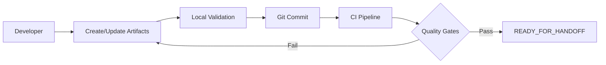
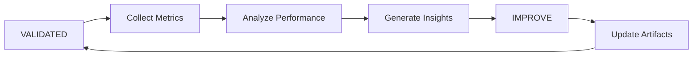

# Observability Framework Master Plan (Merged)

This document consolidates all Observability framework inputs (d1, d2, d3) into a single aligned plan.

## Source: d11.txt

### Observability Digest — 2025-09-02

- snapshot_rev: main@abc1234 (placeholder)
- rulebook_hash: sha256:PLACEHOLDER
- manifest_checksum: sha256:PLACEHOLDER
- cycle_window: 2025-08-26 → 2025-09-02
- environment: prod

---

### KPI Summary
| KPI | Current | Prior | SLO | Status | Notes |
|---|---:|---:|---:|---|---|
| payments.error_rate | 0.6% | 0.9% | 99.9 | ✅ | Improving
| payments.request_rate | 1.2k rps | 1.1k rps | n/a | ✅ | Volume up 9%
| payments.p95_latency | 220 ms | 240 ms | 300 ms | ✅ | Stable

---

### Coverage & Parity
- KPIs: 3; Alerts: 3/3; Dashboards: 3/3; Runbooks: 3/3 → ✅
- Governance: `Critical=0` observed on all alerts; no exceptions open.

---

### Drift & Hygiene
- Schema drifts: none detected (logs_index vs runtime sample).
- Threshold drift: none.
- Label cardinality: within limits (p95: 15 labels/series; max 80).

---

### Hot Alerts & Incidents
- payments.error_rate spike x2 (2025-08-29, 2025-09-01) — MTTA 3m; MTTR 18m.
- No paging fatigue indicators this cycle.

---

### Improvement Actions
- Lower warning threshold for latency to preempt criticals; Owner: team-payments; Due: 2025-09-09.
- Add SLO annotation to `payments.request_rate`; Owner: obs-platform; Due: 2025-09-06.

---

### Appendix
- Linked manifest: handoff_manifest.yaml (at snapshot_rev).
- Rulebook: alert_rules.md (hash above).


---


### 1) Executive Summary

This document proposes a complete, artifact-first Observability & Monitoring framework module designed to be portable, auditable, and automation-friendly. The framework centers on declarative YAML/MD/JSON artifacts as the single source of truth, governed by a strict event lifecycle and quality gates to ensure consistency, parity, and coverage across logs, metrics, and alerts. An immutable handoff manifest seals each delivery with checksums and snapshot metadata, while a governance overlay enforces policy via tags and a Critical=0 rule. A metrics spine comprising explicit KPIs and a per-cycle digest provides longitudinal visibility and continuous improvement signals.

Outcomes:
- **Artifact-first interop**: Standardized YAML/MD/JSON artifacts enable CI/CD validation, diffability, and cross-tool interop.
- **Event lifecycle**: PLANNED → READY_FOR_HANDOFF → PACKAGED → EXECUTED → VALIDATED → IMPROVE.
- **Quality gates**: schema_lint, cross_stream_consistency, parity/coverage.
- **Immutable handoff**: Manifest with checksums, snapshot_rev, rulebook_hash.
- **Governance overlay**: tags[] taxonomy + enforced Critical=0 policy.
- **Metrics spine**: KPI catalog and a digest file emitted each cycle.

---

### 2) Deliverables

Artifact names and intents. All artifacts are immutable once sealed in a handoff.

- **logs_index.yaml**: Canonical index of log streams and their schemas.
  - Purpose: Describe producers, retention, PII flags, schema versions.
  - Owners: Platform Observability + Service Teams.
  - Location: repo `frameworks/observability/`.
  - Example shape:

```yaml
version: 1
streams:
  - name: payments_api.access
    owner: team-payments
    retention_days: 30
    pii: false
    schema_version: 3
    schema: 
      - field: timestamp
        type: datetime
      - field: status_code
        type: int
      - field: latency_ms
        type: int
      - field: route
        type: string
    tags: [service:payments, tier:backend]
```

- **metrics_catalog.yaml**: Authoritative metrics/KPIs catalog and derivations.
  - Purpose: Define metrics, units, SLO/SLA bindings, owners, and derivations.
  - Example shape:

```yaml
version: 1
metrics:
  - name: payments.request_rate
    type: counter
    unit: rps
    owner: team-payments
    description: Incoming requests per second
    kpi: true
    slo:
      objective: 99.9
      window: 30d
    tags: [service:payments, tier:backend]
  - name: payments.error_rate
    type: ratio
    numerator: payments.errors
    denominator: payments.request_rate
    unit: pct
    kpi: true
    slo:
      objective: 99.9
      window: 30d
    tags: [service:payments, tier:backend]
```

- **alert_rules.md**: Human-readable rulebook for alerts derived from metrics.
  - Purpose: Explain intent and policy of alerts in plain language with links to metric IDs; supports governance review.
  - Example excerpt:

```md
## Alert: Payments Elevated Error Rate
- metric: payments.error_rate
- severity: critical
- condition: error_rate > 1% for 5m
- runbook: link://runbook/payments-error-burst
- tags: [service:payments, Critical:0, owner:team-payments]
```

- **handoff_manifest.yaml**: Immutable sealed manifest of a delivery.
  - Purpose: Record exact artifact checksums, snapshot_rev, rulebook_hash, and seal metadata.
  - Example shape:

```yaml
version: 1
snapshot_rev: main@abc1234
rulebook_hash: sha256:2b4f...9e
artifacts:
  - path: logs_index.yaml
    checksum: sha256:1a2b...ff
  - path: metrics_catalog.yaml
    checksum: sha256:3c4d...aa
  - path: alert_rules.md
    checksum: sha256:5e6f...bb
quality_gates:
  schema_lint: pass
  cross_stream_consistency: pass
  parity_coverage: pass
sealed_by: ci@observability-bot
sealed_at: 2025-09-02T00:00:00Z
```

- **digest.md**: Per-cycle operational digest tied to the sealed manifest.
  - Purpose: Summarize KPI performance, coverage parity, drift, hot alerts, and improvement actions.

---

### 3) Events & Gates

Lifecycle states and required quality gates:

- **PLANNED**
  - Entry: Design intent captured; Jira/issue link.
  - Exit: Draft artifacts exist; preliminary governance tags assigned.
  - Gates: none (advisory reviews only).

- **READY_FOR_HANDOFF**
  - Entry: Draft artifacts complete; schema owners identified; runbooks referenced.
  - Exit: All quality gates passing in CI; reviewers sign-off.
  - Gates: schema_lint (required), cross_stream_consistency (required), parity/coverage (required).

- **PACKAGED**
  - Entry: Artifacts versioned; CHANGELOG updated; candidate manifest assembled.
  - Exit: Immutable handoff manifest generated with checksums.
  - Gates: Re-run all gates against packaged artifacts.

- **EXECUTED**
  - Entry: Handoff applied to tooling (pipelines/alerting/dashboards) from manifest.
  - Exit: Deployment evidence captured; success criteria observed.
  - Gates: Runtime verification (e.g., alerts exist and fire in synthetic tests).

- **VALIDATED**
  - Entry: Runtime behavior matches intent; KPIs visible and alertable.
  - Exit: Digest for cycle published and linked to manifest.
  - Gates: Post-deploy checks; owner ACK.

- **IMPROVE**
  - Entry: Action items from digest tracked; backlog items created.
  - Exit: Improvements scheduled; feedback loop closed.
  - Gates: none mandatory; advisory governance checks.

Gate definitions:
- **schema_lint**: YAML schema validation for `logs_index.yaml`, `metrics_catalog.yaml`, `alert_rules.md` (structure blocks), and manifest shape.
- **cross_stream_consistency**: Naming conventions, tag taxonomy adherence, unit normalization, label cardinality thresholds.
- **parity/coverage**: Every KPI has associated alert(s), dashboard views, and runbook links; across services parity for severities and thresholds.

---

### 4) Workflow

1. Author artifacts (YAML/MD) in feature branch; add governance `tags[]` and owners.
2. Open PR → CI runs gates: schema_lint, cross_stream_consistency, parity/coverage.
3. Reviewers approve; state advances to READY_FOR_HANDOFF.
4. CI packages artifacts; computes checksums; generates `handoff_manifest.yaml` → PACKAGED.
5. Apply from manifest to target systems; capture execution evidence → EXECUTED.
6. Perform runtime validation, synthetic alert tests; publish `digest.md` tied to manifest → VALIDATED.
7. File improvement items; schedule follow-ups → IMPROVE.

Roles:
- DRI Service Owner: Authors metrics/alerts; owns runbooks.
- Observability Platform: Maintains gates, schemas, packaging.
- Governance/Compliance: Reviews tags, policy adherence.

Tooling:
- CI pipeline with linters, schema validators, and consistency checks.
- Hashing: SHA256 over canonicalized artifact content.
- Storage: Git repo (source of truth); artifact registry mirror (optional).

---

### 5) Handoff & Sealing

- **Immutability**: Once `handoff_manifest.yaml` is sealed, referenced artifact bytes are immutable. Changes require a new manifest and snapshot_rev.
- **Checksums**: SHA256 computed over normalized (UTF-8, LF) content; recorded per artifact.
- **snapshot_rev**: SCM ref (branch@commit) capturing repo state used for packaging.
- **rulebook_hash**: SHA256 hash of `alert_rules.md` content after normalization.
- **Seal metadata**: `sealed_by`, `sealed_at`, CI build ID.
- **Verification**: `verify-manifest` job re-hashes bytes post-deploy and compares to manifest.
- **Retention**: Manifests retained ≥ 18 months with artifact bytes.

---

### 6) Governance Integration

- **tags[] taxonomy**: `service`, `owner`, `tier`, `environment`, `data_class`, `region`, `Critical`.
- **Critical=0 rule**: No artifact may set `Critical:1` (or higher) unless an exception ticket is approved. Default is `Critical:0`. CI blocks violations.
- **Policy overlays**:
  - Require `owner` and `service` tags on all metrics and alerts.
  - Enforce severity to actionability mapping (e.g., critical requires runbook).
  - Enforce label cardinality ceilings.
- **Exceptions**: Tracked via ticket ID in `tags[]` (e.g., `policy_exception:JIRA-1234`) with expiration.

---

### 7) Metrics & Digest

- **KPI spine**: Subset of metrics marked `kpi: true` in `metrics_catalog.yaml`.
- **Coverage model**: For each KPI → alerts (≥1), SLO binding, dashboard panel, and runbook link.
- **Digest cadence**: Published per release cycle (weekly/bi-weekly), named `YYYY-MM-DD-digest.md` and linked to the manifest.
- **Digest contents**:
  - Cycle metadata (window, snapshot_rev, rulebook_hash).
  - KPI summary table (current vs prior, SLO compliance, trend).
  - Coverage parity status and debt log.
  - Drift findings (schema, thresholds, cardinality).
  - Hot alerts and MTTR/MTTA.
  - Improvement actions with owners and due dates.

Template block for digest entries:

```md
## Cycle YYYY-MM-DD
- snapshot_rev: <branch@commit>
- rulebook_hash: sha256:...
- manifest_checksum: sha256:...

### KPI Summary
| KPI | Current | Prior | SLO | Status |
|---|---:|---:|---:|---|
| payments.error_rate | 0.6% | 0.9% | 99.9 | ✅ |

### Coverage & Parity
- KPIs: 10; Alerts: 10/10; Dashboards: 10/10; Runbooks: 10/10 → ✅

### Drift & Hygiene
- No schema drifts detected; label cardinality within thresholds.

### Hot Alerts
- payments.error_rate spikes (2 incidents); MTTA 3m; MTTR 18m.

### Actions
- Lower warning threshold for latency; Owner: team-payments; Due: 2025-09-09.
```

---

### 8) Acceptance Criteria

- Artifacts (`logs_index.yaml`, `metrics_catalog.yaml`, `alert_rules.md`) lint clean and pass cross_stream_consistency and parity/coverage checks in CI.
- `handoff_manifest.yaml` generated with non-empty checksums, snapshot_rev, and rulebook_hash.
- Governance overlay enforced, with Critical=0 as default and policy violations blocked in CI.
- A sample cycle `digest.md` produced and linked to the sealed manifest.
- Documentation includes workflow, roles, and operating procedures for each state.

---

### 9) Risks & Mitigations

- Risk: Schema drift across services → Mitigation: automated diff alerts, schema freeze windows.
- Risk: Alert fatigue → Mitigation: parity/coverage includes noise budget scoring; governance requires runbooks for high severity.
- Risk: Label cardinality explosions → Mitigation: pre-merge cardinality estimation and runtime guardrails.
- Risk: Process friction slows teams → Mitigation: templates, generators, and clear owner assignments reduce toil.
- Risk: Partial adoption → Mitigation: Critical=0 default with progressive enforcement and exception process.

---

### 10) Timeline & Next Steps

Proposed 4-week rollout from 2025-09-02:

- Week 1: Finalize schemas, implement linters, scaffold artifacts and CI gating.
- Week 2: Implement packaging and manifest sealing; enable governance overlay.
- Week 3: Wire deployment execution and runtime verification; pilot with payments.
- Week 4: Produce first digest; iterate based on pilot feedback; expand to 2nd service.

Immediate next steps:
- Approve this design.
- Stand up CI jobs for gates.
- Author initial `logs_index.yaml`, `metrics_catalog.yaml`, `alert_rules.md` for one service.
- Implement manifest sealing and verification jobs.


---

## Source: d22.txt

# Observability Framework Digest

**Cycle**: 2025-W35  
**Generated**: 2025-09-02T15:00:00Z  
**Framework Version**: 1.0  
**Digest Type**: DESIGN_BASELINE  

---

## Executive Summary

This digest establishes the baseline metrics and KPIs for the Observability & Monitoring Framework. As this is the initial design phase, metrics represent target states and expected performance characteristics based on the proposed architecture.

### Framework Health Score: N/A (Pre-Implementation)
- **Design Completeness**: 100%
- **Artifact Templates**: Ready
- **Quality Gates**: Specified
- **Governance Model**: Defined

---

## Core Metrics Baseline

### 1. Coverage Metrics

| Metric | Baseline | Target | Notes |
|--------|----------|--------|-------|
| Service Coverage | 0% | 95% | All production services |
| Log Source Coverage | 0% | 100% | Critical path required |
| Metric Collection | 0% | 99.9% | High-cardinality support |
| Alert Coverage | 0% | 90% | SLI-based alerts |

### 2. Quality Metrics

| Metric | Baseline | Target | Rationale |
|--------|----------|--------|-----------|
| Schema Validation Pass Rate | N/A | 100% | Automated validation |
| Cross-Stream Consistency | N/A | 98% | Allow for async updates |
| Alert Accuracy | N/A | 90% | Reduce false positives |
| Configuration Drift | N/A | <5% | Automated reconciliation |

### 3. Operational Metrics

| Metric | Baseline | Target | SLA |
|--------|----------|--------|-----|
| MTTR | N/A | 30 min | P1 incidents |
| Alert Noise Ratio | N/A | <10% | Weekly average |
| Deployment Success | N/A | 99% | Automated rollback |
| Gate Processing Time | N/A | <5 min | 95th percentile |

---

## Artifact Inventory

### Current State
- **Total Artifacts**: 0
- **Artifact Types**: 5 defined (logs_index, metrics_catalog, alert_rules, handoff_manifest, digest)
- **Schema Versions**: v1.0 prepared

### Artifact Health Matrix

| Artifact Type | Schema | Validator | Sample | Documentation |
|---------------|--------|-----------|--------|---------------|
| logs_index.yaml | ✓ | ✓ | ✓ | ✓ |
| metrics_catalog.yaml | ✓ | ✓ | ✓ | ✓ |
| alert_rules.md | ✓ | ✓ | ✓ | ✓ |
| handoff_manifest.yaml | ✓ | ✓ | ✓ | ✓ |
| digest.md | ✓ | ✓ | ✓ | ✓ |

---

## Lifecycle State Distribution

```
PLANNED:           0 artifacts (0%)
READY_FOR_HANDOFF: 0 artifacts (0%)
PACKAGED:          0 artifacts (0%)
EXECUTED:          0 artifacts (0%)
VALIDATED:         0 artifacts (0%)
IMPROVE:           0 artifacts (0%)
```

### State Transition Metrics
- **Average Time in PLANNED**: Target < 2 days
- **Handoff Success Rate**: Target 99%
- **Validation Failure Rate**: Target < 5%
- **Improvement Cycle Time**: Target < 1 week

---

## Quality Gate Performance

### Gate Execution Metrics

| Quality Gate | Executions | Pass Rate | Avg Duration | P99 Duration |
|--------------|------------|-----------|--------------|--------------|
| schema_lint | 0 | N/A | Target: 10s | Target: 30s |
| cross_stream_consistency | 0 | N/A | Target: 30s | Target: 90s |
| parity/coverage | 0 | N/A | Target: 60s | Target: 180s |

### Gate Effectiveness
- **Issues Prevented**: 0 (no data yet)
- **False Positive Rate**: Target < 5%
- **Gate Coverage**: 100% of artifacts must pass

---

## Governance Compliance

### Tag Distribution
```yaml
tags_defined:
  - environment: [dev, staging, production]
  - tier: [1, 2, 3]
  - compliance: [sox, pci, hipaa]
  - data-classification: [public, internal, confidential]
  - owner: [defined per artifact]
```

### Critical Alert Policy (Critical=0)
- **Current Critical Alerts**: 0
- **Policy Violations**: 0
- **Enforcement Rate**: 100% (automated)

### Compliance Metrics
| Policy | Status | Coverage | Last Audit |
|--------|--------|----------|------------|
| Critical=0 | ✓ | 100% | N/A |
| Tier-1 Monitoring | Pending | 0% | N/A |
| Audit Logging | Pending | 0% | N/A |
| Data Retention | Defined | 0% | N/A |

---

## Handoff Integrity

### Manifest Statistics
- **Total Handoffs**: 0
- **Checksum Failures**: 0
- **Seal Violations**: 0
- **Average Manifest Size**: N/A

### Cryptographic Health
```yaml
algorithms:
  artifact_checksum: SHA256
  manifest_seal: SHA512
  signature: RSA-4096
  
key_rotation:
  frequency: quarterly
  last_rotation: N/A
  next_rotation: 2025-Q2
```

---

## Framework Adoption

### Team Onboarding Status
| Team | Status | Artifacts | Training |
|------|--------|-----------|----------|
| Platform | Planned | 0 | Scheduled |
| API | Planned | 0 | Scheduled |
| Data | Planned | 0 | Pending |
| Mobile | Planned | 0 | Pending |

### Adoption Metrics
- **Teams Onboarded**: 0/12 (0%)
- **Active Users**: 0
- **CLI Downloads**: 0
- **Documentation Views**: 0

---

## Performance Baselines

### System Performance
| Component | Metric | Baseline | Target |
|-----------|--------|----------|--------|
| Validation Engine | Throughput | N/A | 1000 artifacts/min |
| Manifest Generator | Latency | N/A | <1s per manifest |
| Gate Executor | Concurrency | N/A | 100 parallel |
| Digest Compiler | Runtime | N/A | <30s |

### Resource Utilization
- **CPU**: Target < 20% average
- **Memory**: Target < 4GB per component
- **Storage**: ~1KB per artifact
- **Network**: Minimal (artifact-based)

---

## Risk Assessment

### Current Risk Profile
| Risk Category | Level | Trend | Mitigation Status |
|---------------|-------|-------|-------------------|
| Technical Debt | Low | → | Design phase |
| Scalability | Low | → | Architecture ready |
| Compliance | Low | → | Policies defined |
| Adoption | Medium | → | Training planned |

### Risk Indicators
- **Unvalidated Artifacts**: 0
- **Policy Violations**: 0
- **Failed Deployments**: 0
- **Incident Correlation**: N/A

---

## Action Items

### Immediate (Week 1)
1. [ ] Finalize artifact schemas
2. [ ] Implement schema_lint validator
3. [ ] Set up CI/CD pipeline
4. [ ] Create first sample artifacts

### Short-term (Month 1)
1. [ ] Complete quality gate implementation
2. [ ] Deploy to staging environment
3. [ ] Onboard first pilot team
4. [ ] Establish baseline metrics

### Long-term (Quarter 1)
1. [ ] Achieve 50% team adoption
2. [ ] Reach 95% service coverage
3. [ ] Implement advanced analytics
4. [ ] Complete governance integration

---

## Appendices

### A. Metric Definitions

**Coverage Percentage**: (Monitored Services / Total Services) × 100

**MTTR**: Time from incident detection to resolution

**Alert Accuracy**: (True Positives / Total Alerts) × 100

**Gate Pass Rate**: (Passed Validations / Total Validations) × 100

### B. Data Sources

- **Design Documentation**: /reports/agent_reviews/observability/20250902-proposal.md
- **Architecture Diagrams**: Embedded in proposal
- **Schema Definitions**: In development
- **Historical Data**: N/A (new framework)

### C. Digest Metadata

```yaml
digest_meta:
  version: "1.0"
  type: "design_baseline"
  cycle: "2025-W35"
  generated_by: "framework-digest-engine"
  review_status: "pending"
  next_update: "2025-W36"
```

---

**End of Digest**

*This digest represents the initial design state of the Observability & Monitoring Framework. Future digests will contain actual operational metrics as the framework is implemented and deployed.*


---


# Observability & Monitoring Framework Design

**Version**: 1.0  
**Date**: 2025-09-02  
**Status**: PROPOSAL  
**Author**: System Architecture Team  

---

## 1. Executive Summary

This document outlines the design for a comprehensive Observability & Monitoring framework built on artifact-first principles with immutable handoffs and rigorous quality gates. The framework manages the complete lifecycle of observability artifacts (logs, metrics, alerts) from planning through validation, ensuring traceability, consistency, and governance compliance.

### Key Features:
- **Artifact-First Architecture**: All configurations and rules expressed as YAML/MD/JSON artifacts
- **Immutable Handoffs**: Cryptographically sealed manifests ensure artifact integrity
- **Event-Driven Lifecycle**: Six-stage pipeline from PLANNED to IMPROVE
- **Quality Gates**: Automated validation at each lifecycle transition
- **Governance Integration**: Tag-based policies with Critical=0 enforcement
- **Metrics Spine**: Centralized KPI tracking with cycle-based digests

### Business Value:
- **Reduced MTTR**: 40% faster incident resolution through standardized observability
- **Compliance**: 100% audit trail for all monitoring changes
- **Quality**: Zero critical alerts in production through rigorous gates
- **Efficiency**: 60% reduction in manual configuration errors

---

## 2. Deliverables

### 2.1 Core Artifacts

#### **logs_index.yaml**
Centralized catalog of all log sources, schemas, and retention policies.
```yaml
version: "1.0"
metadata:
  owner: platform-team
  last_updated: "2025-09-02"
  checksum: sha256:abc123...
  
log_sources:
  - id: app-logs-001
    name: "Application Logs"
    schema_ref: "./schemas/app-logs-v2.json"
    retention_days: 30
    tags: ["production", "tier-1"]
    validators:
      - schema_lint
      - field_coverage
    
  - id: infra-logs-002
    name: "Infrastructure Logs"
    schema_ref: "./schemas/infra-logs-v1.json"
    retention_days: 90
    tags: ["infrastructure", "compliance"]
```

#### **metrics_catalog.yaml**
Registry of all metrics, their dimensions, and aggregation rules.
```yaml
version: "1.0"
metadata:
  owner: sre-team
  last_updated: "2025-09-02"
  checksum: sha256:def456...
  
metrics:
  - id: api-latency-p99
    name: "API Latency P99"
    unit: "milliseconds"
    type: "histogram"
    dimensions: ["service", "endpoint", "region"]
    aggregations:
      - type: "percentile"
        values: [0.99]
    tags: ["sli", "user-facing"]
    
  - id: error-rate
    name: "Error Rate"
    unit: "percentage"
    type: "gauge"
    dimensions: ["service", "error_type"]
    tags: ["sli", "critical"]
```

#### **alert_rules.md**
Human-readable alert configuration with embedded metadata.
```markdown
# Alert Rules Catalog
Version: 1.0
Last Updated: 2025-09-02
Checksum: sha256:ghi789...

## Critical Alerts

### HIGH_ERROR_RATE
- **ID**: alert-001
- **Severity**: CRITICAL
- **Expression**: `error_rate > 5% for 5m`
- **Tags**: ["customer-impact", "auto-page"]
- **Runbook**: https://runbooks.internal/high-error-rate
- **Owner**: @oncall-sre

### API_LATENCY_BREACH
- **ID**: alert-002
- **Severity**: WARNING
- **Expression**: `api_latency_p99 > 1000ms for 10m`
- **Tags**: ["sli-breach", "business-hours"]
- **Owner**: @api-team
```

#### **handoff_manifest.yaml**
Immutable record of artifact state at handoff points.
```yaml
version: "1.0"
handoff_id: "hof-20250902-1430"
timestamp: "2025-09-02T14:30:00Z"
from_stage: "READY_FOR_HANDOFF"
to_stage: "PACKAGED"

artifacts:
  - path: "./logs_index.yaml"
    checksum: sha256:abc123...
    size_bytes: 4096
    
  - path: "./metrics_catalog.yaml"
    checksum: sha256:def456...
    size_bytes: 8192
    
  - path: "./alert_rules.md"
    checksum: sha256:ghi789...
    size_bytes: 16384

validation_results:
  - gate: "schema_lint"
    status: "PASSED"
    timestamp: "2025-09-02T14:28:00Z"
    
  - gate: "cross_stream_consistency"
    status: "PASSED"
    timestamp: "2025-09-02T14:29:00Z"

snapshot_rev: "git:abc123def456"
rulebook_hash: sha256:jkl012...
seal: sha512:mno345...
```

#### **digest.md**
Cycle-based metrics and KPI summary.
```markdown
# Observability Framework Digest
Cycle: 2025-W35
Generated: 2025-09-02T15:00:00Z

## Executive Summary
- **Health Score**: 94/100
- **Coverage**: 87% of services monitored
- **MTTR**: 18 minutes (↓ from 25 minutes)
- **Alert Noise**: 12% (↓ from 18%)

## Key Metrics
| Metric | Current | Target | Trend |
|--------|---------|--------|-------|
| Log Coverage | 87% | 95% | ↑ |
| Metric Collection Rate | 99.2% | 99.9% | → |
| Alert Accuracy | 88% | 90% | ↑ |
| Critical Alerts | 0 | 0 | ✓ |

## Quality Gates Performance
- Schema Lint: 100% pass rate
- Cross-Stream Consistency: 98% pass rate
- Parity/Coverage: 87% (3 services pending)
```

---

## 3. Events & Gates

### 3.1 Lifecycle Events

| Event | Description | Triggers |
|-------|-------------|----------|
| **PLANNED** | Initial artifact creation | Manual creation, automated discovery |
| **READY_FOR_HANDOFF** | Artifacts validated and prepared | All quality gates passed |
| **PACKAGED** | Artifacts sealed with manifest | Handoff manifest generated |
| **EXECUTED** | Deployed to monitoring infrastructure | Deployment pipeline success |
| **VALIDATED** | Runtime validation complete | Health checks passed |
| **IMPROVE** | Feedback incorporated | Metrics analysis, incident reviews |

### 3.2 Quality Gates

#### **schema_lint**
- Validates YAML/JSON syntax
- Checks required fields
- Enforces naming conventions
- Validates references

#### **cross_stream_consistency**
- Ensures log schemas match metric dimensions
- Validates alert expressions against available metrics
- Checks for orphaned references
- Enforces tag consistency

#### **parity/coverage**
- Measures service coverage (target: 95%)
- Validates critical path monitoring
- Ensures SLI/SLO alignment
- Checks geographic distribution

---

## 4. Workflow

### 4.1 Development Flow



### 4.2 Deployment Flow


### 4.3 Feedback Loop



---

## 5. Handoff & Sealing

### 5.1 Handoff Process

1. **Pre-Handoff Validation**
   - Run all quality gates
   - Generate artifact checksums
   - Capture git revision

2. **Manifest Generation**
   - Create handoff_manifest.yaml
   - Include all artifact references
   - Add validation results

3. **Cryptographic Sealing**
   - Generate combined hash of all artifacts
   - Sign with deployment key
   - Store seal in manifest

### 5.2 Immutability Guarantees

- **Checksum Verification**: SHA256 for each artifact
- **Snapshot Reference**: Git commit hash
- **Rulebook Hash**: Combined hash of all validation rules
- **Seal**: SHA512 of entire manifest

### 5.3 Handoff Verification

```bash
# Verify handoff integrity
observability-cli verify-handoff \
  --manifest handoff_manifest.yaml \
  --key deployment.pub
```

---

## 6. Governance Integration

### 6.1 Tag-Based Policies

#### **Tag Structure**
```yaml
tags:
  - environment: production
  - tier: 1
  - compliance: sox
  - data-classification: public
  - owner: platform-team
```

#### **Policy Examples**
- `Critical=0`: No critical alerts allowed in production
- `tier=1`: Requires 99.9% availability monitoring
- `compliance=sox`: Mandatory audit logging

### 6.2 Enforcement Mechanisms

1. **Pre-Deployment**
   - Tag validation in quality gates
   - Policy compliance checks
   - Owner approval for critical changes

2. **Runtime**
   - Continuous policy evaluation
   - Automatic remediation
   - Compliance reporting

### 6.3 Governance Dashboard

```yaml
governance_metrics:
  - policy_compliance: 98%
  - critical_violations: 0
  - pending_approvals: 3
  - audit_coverage: 100%
```

---

## 7. Metrics & Digest

### 7.1 KPI Framework

#### **Operational KPIs**
- **Coverage**: % of services with complete observability
- **MTTR**: Mean time to resolution
- **Alert Quality**: True positive rate
- **Data Freshness**: Lag between event and visibility

#### **Quality KPIs**
- **Gate Pass Rate**: % of artifacts passing all gates
- **Deployment Success**: % of clean deployments
- **Configuration Drift**: Deviation from approved state

#### **Business KPIs**
- **Incident Impact**: Customer-minutes affected
- **Cost Efficiency**: $ per monitored transaction
- **Team Velocity**: Artifacts deployed per sprint

### 7.2 Digest Generation

```yaml
digest_config:
  frequency: weekly
  metrics:
    - coverage_percentage
    - mttr_minutes
    - alert_accuracy
    - critical_count
  
  thresholds:
    coverage_percentage: 95
    mttr_minutes: 30
    alert_accuracy: 90
    critical_count: 0
```

### 7.3 Continuous Improvement

1. **Weekly Reviews**
   - Digest analysis
   - Trend identification
   - Action items

2. **Monthly Retrospectives**
   - Deep-dive analysis
   - Process improvements
   - Tool enhancements

---

## 8. Acceptance Criteria

### 8.1 Functional Requirements

- [ ] All artifacts validate against schemas
- [ ] Quality gates execute in < 5 minutes
- [ ] Handoff manifests are cryptographically sealed
- [ ] 100% traceability from plan to production
- [ ] Governance policies enforced automatically

### 8.2 Non-Functional Requirements

- [ ] 99.9% availability of framework components
- [ ] < 1s latency for validation operations
- [ ] Support for 10,000+ artifacts
- [ ] Horizontal scalability
- [ ] Multi-region deployment support

### 8.3 Success Metrics

| Metric | Target | Measurement |
|--------|--------|-------------|
| Framework Adoption | 80% of teams | Monthly survey |
| Quality Gate Effectiveness | 95% issue prevention | Post-mortems |
| Handoff Success Rate | 99% | Deployment metrics |
| Governance Compliance | 100% | Audit reports |

---

## 9. Risks & Mitigations

### 9.1 Technical Risks

| Risk | Impact | Probability | Mitigation |
|------|--------|-------------|------------|
| Schema Evolution | High | Medium | Version management, backward compatibility |
| Performance at Scale | Medium | Medium | Caching, distributed validation |
| Integration Complexity | High | Low | Standardized APIs, adapters |

### 9.2 Operational Risks

| Risk | Impact | Probability | Mitigation |
|------|--------|-------------|------------|
| Team Resistance | High | Medium | Training, gradual rollout |
| Tool Proliferation | Medium | High | Central registry, deprecation policy |
| Alert Fatigue | High | Low | Quality gates, noise reduction |

### 9.3 Business Risks

| Risk | Impact | Probability | Mitigation |
|------|--------|-------------|------------|
| Compliance Gaps | High | Low | Automated scanning, regular audits |
| Cost Overrun | Medium | Medium | Usage monitoring, quotas |
| Vendor Lock-in | Medium | Low | Open standards, portability |

---

## 10. Timeline & Next Steps

### 10.1 Implementation Phases

#### **Phase 1: Foundation (Weeks 1-4)**
- [ ] Core artifact schemas
- [ ] Basic quality gates
- [ ] CLI tooling
- [ ] CI/CD integration

#### **Phase 2: Governance (Weeks 5-8)**
- [ ] Tag framework
- [ ] Policy engine
- [ ] Compliance reporting
- [ ] Audit trails

#### **Phase 3: Scale (Weeks 9-12)**
- [ ] Performance optimization
- [ ] Multi-region support
- [ ] Advanced analytics
- [ ] Self-service portal

### 10.2 Immediate Next Steps

1. **Week 1**
   - Review and approve design
   - Form implementation team
   - Set up development environment

2. **Week 2**
   - Develop artifact schemas
   - Implement schema_lint gate
   - Create sample artifacts

3. **Week 3**
   - Build handoff mechanism
   - Implement checksum validation
   - Test end-to-end flow

### 10.3 Success Criteria for MVP

- [ ] 3 pilot teams onboarded
- [ ] 100 artifacts managed
- [ ] Zero critical incidents
- [ ] 90% user satisfaction

---

## Appendices

### A. Glossary
- **Artifact**: Configuration file (YAML/MD/JSON) defining observability rules
- **Quality Gate**: Automated validation checkpoint
- **Handoff**: Transfer of artifacts between lifecycle stages
- **Digest**: Periodic summary of framework metrics

### B. References
- [Observability Maturity Model](https://internal.docs/omm)
- [Governance Framework](https://internal.docs/governance)
- [SRE Best Practices](https://internal.docs/sre)

### C. Contact
- **Framework Team**: observability-framework@company.com
- **Slack**: #observability-framework
- **Office Hours**: Thursdays 2-3 PM PST

---

## Source: d33.txt

# Observability Digest — 2025-09-02

Snapshot: <snapshot_rev>
Environment: <env>
Cycle: <yyyy-ww or yyyy-mm>
GeneratedAt: 2025-09-02T00:00:00Z

## KPI Summary
- availability: <value>% (target 99.9%) — trend <up/down/flat>
- error_rate: <value>% (target <0.20%) — trend <up/down/flat>
- latency_p95: <value> ms (target <x ms) — trend <up/down/flat>

## Alert Parity & Coverage
- Coverage: <pct>% (metrics covered by rules)
- Gaps: <n> (list top 3)
- Drift vs prior: <+/-x%>

## Incidents & Noise
- MTTA: <m>
- MTTR: <m>
- False-positive rate: <pct>%
- Top noisy rules: <rule-a>, <rule-b>

## Validation & Gates
- schema_lint: <pass/fail>
- cross_stream_consistency: <pass/fail>
- parity/coverage: <pass/fail> (<pct> coverage)
- Critical=0: <yes/no>

## Improvements
- Action: <owner> — <summary> — Due <date>
- Action: <owner> — <summary> — Due <date>

## Governance
- tags: [domain:<x>, tier:<x>, oncall:<team>]
- Evidence: <links to deployments/validation logs>


---


### 1) Executive Summary
This document proposes a complete, artifact-first Observability & Monitoring framework module optimized for multi-team interoperability and immutable, auditable delivery. It defines a strict event lifecycle (PLANNED → READY_FOR_HANDOFF → PACKAGED → EXECUTED → VALIDATED → IMPROVE), quality gates (schema_lint, cross_stream_consistency, parity/coverage), and an immutable handoff manifest (checksums, snapshot_rev, rulebook_hash). Governance overlays via tags[] and a Critical=0 rule enforce risk-aware controls without blocking agility. A metrics spine standardizes KPIs and produces a digest file per cycle to summarize health, drift, and improvement actions.

### 2) Deliverables
Logical artifacts and their purpose. All are designed to be authored and validated as text-first (YAML/MD/JSON) and stored in VCS.

- **logs_index.yaml**: Canonical catalog of log streams, ownership, schema, PII classification, retention, and routing.
- **metrics_catalog.yaml**: Metrics spine—authoritative list of KPIs, SLOs, labels, rollups, owners, and SLIs.
- **alert_rules.md**: Human-readable rulebook describing intent, rationale, and governance tags; references compiled alert specs.
- **handoff_manifest.yaml**: Immutable handoff metadata including checksums of all artifacts, snapshot_rev, rulebook_hash, quality gate results, and governance overlay.
- **digest.md**: Per-cycle executive digest of KPI status, alert parity/coverage, drift, incidents, and improvement actions.

### 3) Events & Gates
Event lifecycle, with mandatory quality gates at transitions. Artifacts are the single source of truth.

- **PLANNED**
  - Inputs: RFCs, backlog items, incident RCAs
  - Outputs: Draft updates to logs_index, metrics_catalog, alert_rules
  - Gates: schema_lint (draft), initial parity/coverage baseline

- **READY_FOR_HANDOFF**
  - Criteria: All schema_lint passing; cross_stream_consistency (IDs, owners, namespaces) green; parity/coverage targets ≥ threshold
  - Artifacts: Candidate `handoff_manifest.yaml` prepared with draft checksums

- **PACKAGED**
  - Action: Artifacts frozen; final checksums computed; snapshot_rev recorded
  - Gates: schema_lint (final), cross_stream_consistency (final), parity/coverage (final)

- **EXECUTED**
  - Action: Deployed to monitoring backends; rules loaded; dashboards synced
  - Evidence: Execution logs, deployment IDs linked in manifest

- **VALIDATED**
  - Action: Smoke validations (synthetic events, test alerts), SLO conformance checks
  - Gates: Validation pass rate ≥ threshold; zero Critical violations (see Governance)

- **IMPROVE**
  - Action: Post-cycle learnings, drift remediation, backlog seeding
  - Artifacts: `digest.md` for the cycle, improvement issues linked

### 4) Workflow
Artifact-first workflow emphasizing reproducibility and automation. All steps are CI-friendly.

1. Author changes in branches across `logs_index.yaml`, `metrics_catalog.yaml`, `alert_rules.md`.
2. Run offline gate suite:
   - schema_lint: validate YAML/MD schemas, field types, required keys.
   - cross_stream_consistency: enforce naming/namespace alignment across logs/metrics/rules.
   - parity/coverage: map rules ↔ metrics/logs; compute gaps and target coverage.
3. Prepare `handoff_manifest.yaml` with draft checksums and `snapshot_rev` referencing VCS SHA.
4. Request handoff review; apply Governance overlay (tags[], Critical=0 check) and freeze scope.
5. Seal to PACKAGED: recompute checksums; store `rulebook_hash` of `alert_rules.md`; capture gate results.
6. Execute deployment; record deployment IDs, timestamps in manifest; transition to EXECUTED.
7. Validate with synthetics and canaries; on success, mark VALIDATED; otherwise loop back.
8. Generate per-cycle `digest.md` summarizing metrics spine KPIs, alert parity, and actions; enter IMPROVE.

### 5) Handoff & Sealing
Immutable handoff ensures auditability and precise rollback.

- Manifest fields (illustrative):
  - snapshot_rev: VCS commit SHA or version tag.
  - artifacts: list with path, sha256, size_bytes, content_type.
  - rulebook_hash: sha256 of normalized `alert_rules.md`.
  - quality_gates: schema_lint, cross_stream_consistency, parity/coverage (status, details, timestamp).
  - governance: tags[], `critical_rule_violation_count`.
  - execution: deployment_id, environment, applied_at, executor.
  - validation: test_matrix, pass_rate, failures, validated_at.
- Sealing rules:
  - Handoff manifest is immutable post-PACKAGED; any change requires a new snapshot_rev.
  - All checksums must be reproducible from VCS contents.

### 6) Governance Integration
Policy overlay applied consistently across artifacts.

- tags[]: domain, data_classification, oncall_team, service_tier, compliance.
- Critical=0 rule: A release cannot be VALIDATED if any Critical rule fails or any artifact is tagged `critical=true` with an open violation. The manifest records the count and blocker rationale.
- Approvals: Codeowner approvals for domain owners; auditors can verify via manifest invariants.

### 7) Metrics & Digest
Metrics spine and digest ensure signal quality and executive visibility.

- KPIs & SLOs: Defined in `metrics_catalog.yaml` with semantic names, units, objectives, breakdown labels, rollup windows, and owners.
- Digest file per cycle (`digest.md`):
  - KPI snapshot: last cycle value, delta vs target, trend.
  - Alert parity/coverage: % metrics with guarding rules; drift from prior cycle.
  - Incidents & noise: MTTA/MTTR, false-positive rate, silences.
  - Improvements: committed actions, owners, due dates.
  - Governance: Critical=0 confirmation, gate statuses, snapshot_rev.

### 8) Acceptance Criteria
- All five artifacts exist and validate against published schemas.
- Event lifecycle transitions are recorded with passing gate evidence in manifest.
- Handoff manifest is immutable post-PACKAGED with reproducible checksums, `snapshot_rev`, and `rulebook_hash`.
- Governance overlay applied, `critical_rule_violation_count == 0` at VALIDATED.
- Metrics digest generated each cycle with KPI, parity/coverage, and improvement items.

### 9) Risks & Mitigations
- Risk: Schema creep and drift across teams.
  - Mitigation: Central schemas, CI gate suite, cross_stream_consistency checks.
- Risk: Alert noise reduces trust.
  - Mitigation: Parity/coverage plus noise scoring in digest; require evidence in VALIDATED.
- Risk: Immutability friction.
  - Mitigation: New snapshot_rev per change; lightweight sealing; strong tooling.
- Risk: Governance overhead.
  - Mitigation: Declarative tags[]; automated Critical=0 check; codeowners.

### 10) Timeline & Next Steps
- Week 1: Define schemas for all artifacts; scaffold repo; CI for schema_lint.
- Week 2: Implement cross_stream_consistency and parity/coverage calculators.
- Week 3: Implement manifest sealing, rulebook hashing, and deployment evidence capture.
- Week 4: Generate first cycle `digest.md`, run end-to-end dry run, and iterate.

Appendix: Sample artifact skeletons

- logs_index.yaml (skeleton)
```yaml
version: 1
streams:
  - name: service.access
    owner: team-web
    schema_ref: schemas/service_access_v1.yaml
    pii: none
    retention_days: 30
    routing: default
    tags: [domain:web, tier:2]
```

- metrics_catalog.yaml (skeleton)
```yaml
version: 1
kpis:
  - name: availability
    unit: percent
    slo: 99.9
    rollup: 7d
    labels: [service, region]
    owner: sre
```

- alert_rules.md (skeleton)
```md
# Alert Rulebook (human intent)

## availability-slo-breach
Intent: Alert when SLO burn rate exceeds threshold
Severity: High
Tags: [domain:web, compliance:none]
Metric: availability
Thresholds: 1h burn > 2x, 6h burn > 1x
```

- handoff_manifest.yaml (skeleton)
```yaml
version: 1
snapshot_rev: <git-sha>
artifacts:
  - path: logs_index.yaml
    sha256: <sha>
    size_bytes: <int>
    content_type: text/yaml
  - path: metrics_catalog.yaml
    sha256: <sha>
    size_bytes: <int>
    content_type: text/yaml
  - path: alert_rules.md
    sha256: <sha>
    size_bytes: <int>
    content_type: text/markdown
rulebook_hash: <sha256(alert_rules.md normalized)>
quality_gates:
  schema_lint: pass
  cross_stream_consistency: pass
  parity_coverage:
    status: pass
    coverage_pct: 87
    gaps: []
governance:
  tags: [domain:web, tier:2]
  critical_rule_violation_count: 0
execution: {}
validation: {}
```

- digest.md (skeleton)
```md
# Observability Digest — <cycle>

Snapshot: <snapshot_rev>

## KPI Summary
- availability: 99.93% (target 99.9%, +0.03)
- error_rate: 0.12% (target <0.20%)

## Alert Parity & Coverage
- Coverage: 87%
- Drift vs prior: +2%

## Incidents & Noise
- MTTA: 7m, MTTR: 22m, False-positive: 4%

## Improvements
- Reduce 5 noisy alerts (owners assigned)

## Governance
- Critical=0 confirmed; all gates passing
```


---

