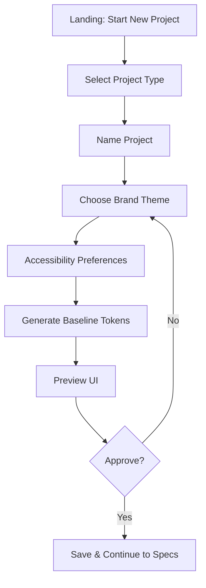

## User Flow: New Project Onboarding

### Goal
Guide a user from starting a project to seeing first design preview.

### Flow Diagram

### Key UX Notes
- Autosave at each step; breadcrumbs for navigation
- Real-time contrast checks during theme selection
- Keyboard-only path validated for all steps

