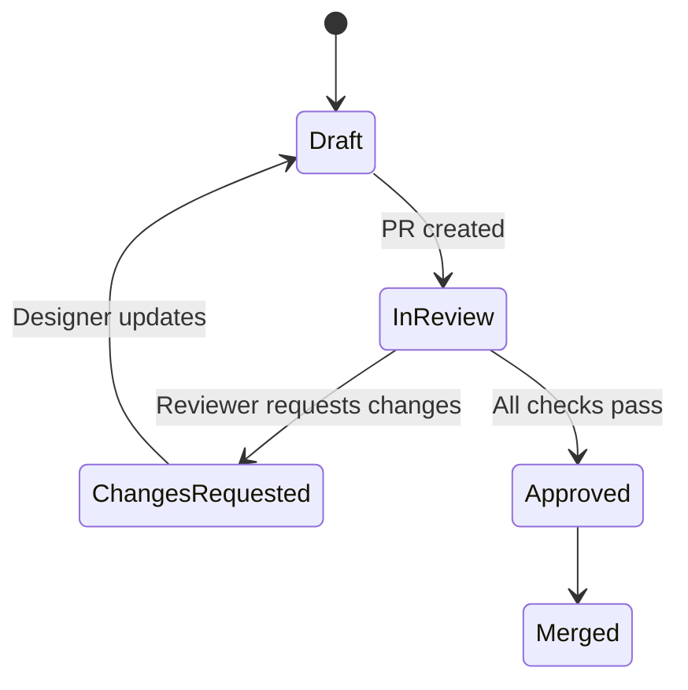

## Flow: Design Review & Approval

### Goal
Ensure quality gates pass for design tokens, components, and accessibility before merge.

### Flow Diagram

### Quality Gates
- AA contrast verified (light/dark)
- Keyboard navigation validated
- Component states covered
- Preview build links included

