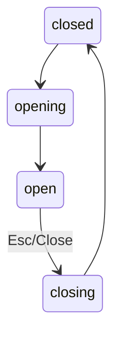

## Component Spec: Modal Dialog

### Purpose
Blocking container for critical tasks and confirmations with trapped focus.

### Props (contract)
```json
{
  "component": "Modal",
  "props": {
    "open": {"type": "boolean", "required": true},
    "titleId": {"type": "string", "required": true},
    "onClose": {"type": "() => void", "required": true}
  }
}
```

### States
- closed → opening → open → closing → closed

### Accessibility
- Role: `dialog`; `aria-modal=true`; `aria-labelledby=titleId`
- Trap focus inside; return focus to invoker on close
- Provide ESC to close and visible close button with label

### Keyboard
- Tab/Shift+Tab cycles within dialog (focus trap)
- Esc closes; Enter triggers primary action

### Interaction Spec (JSON)
```json
{
  "component": "Modal",
  "states": ["closed","opening","open","closing"],
  "keyboard": {"Tab":"trap","Shift+Tab":"trap","Esc":"close","Enter":"primary action"},
  "aria": {"role":"dialog","aria-modal":true,"aria-labelledby":"titleId"},
  "timings_ms": {"open":280,"close":180},
  "tokens": {"shadow":"{shadow.level_3}","radius":"{radii.lg}","motion":"{motion.duration_ms.modal}"}
}
```

### State Diagram


