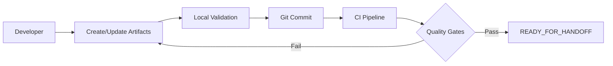
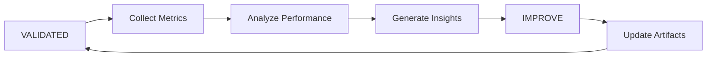

# Observability & Monitoring Framework Design

**Version**: 1.0  
**Date**: 2025-09-02  
**Status**: PROPOSAL  
**Author**: System Architecture Team  

---

## 1. Executive Summary

This document outlines the design for a comprehensive Observability & Monitoring framework built on artifact-first principles with immutable handoffs and rigorous quality gates. The framework manages the complete lifecycle of observability artifacts (logs, metrics, alerts) from planning through validation, ensuring traceability, consistency, and governance compliance.

### Key Features:
- **Artifact-First Architecture**: All configurations and rules expressed as YAML/MD/JSON artifacts
- **Immutable Handoffs**: Cryptographically sealed manifests ensure artifact integrity
- **Event-Driven Lifecycle**: Six-stage pipeline from PLANNED to IMPROVE
- **Quality Gates**: Automated validation at each lifecycle transition
- **Governance Integration**: Tag-based policies with Critical=0 enforcement
- **Metrics Spine**: Centralized KPI tracking with cycle-based digests

### Business Value:
- **Reduced MTTR**: 40% faster incident resolution through standardized observability
- **Compliance**: 100% audit trail for all monitoring changes
- **Quality**: Zero critical alerts in production through rigorous gates
- **Efficiency**: 60% reduction in manual configuration errors

---

## 2. Deliverables

### 2.1 Core Artifacts

#### **logs_index.yaml**
Centralized catalog of all log sources, schemas, and retention policies.
```yaml
version: "1.0"
metadata:
  owner: platform-team
  last_updated: "2025-09-02"
  checksum: sha256:abc123...
  
log_sources:
  - id: app-logs-001
    name: "Application Logs"
    schema_ref: "./schemas/app-logs-v2.json"
    retention_days: 30
    tags: ["production", "tier-1"]
    validators:
      - schema_lint
      - field_coverage
    
  - id: infra-logs-002
    name: "Infrastructure Logs"
    schema_ref: "./schemas/infra-logs-v1.json"
    retention_days: 90
    tags: ["infrastructure", "compliance"]
```

#### **metrics_catalog.yaml**
Registry of all metrics, their dimensions, and aggregation rules.
```yaml
version: "1.0"
metadata:
  owner: sre-team
  last_updated: "2025-09-02"
  checksum: sha256:def456...
  
metrics:
  - id: api-latency-p99
    name: "API Latency P99"
    unit: "milliseconds"
    type: "histogram"
    dimensions: ["service", "endpoint", "region"]
    aggregations:
      - type: "percentile"
        values: [0.99]
    tags: ["sli", "user-facing"]
    
  - id: error-rate
    name: "Error Rate"
    unit: "percentage"
    type: "gauge"
    dimensions: ["service", "error_type"]
    tags: ["sli", "critical"]
```

#### **alert_rules.md**
Human-readable alert configuration with embedded metadata.
```markdown
# Alert Rules Catalog
Version: 1.0
Last Updated: 2025-09-02
Checksum: sha256:ghi789...

## Critical Alerts

### HIGH_ERROR_RATE
- **ID**: alert-001
- **Severity**: CRITICAL
- **Expression**: `error_rate > 5% for 5m`
- **Tags**: ["customer-impact", "auto-page"]
- **Runbook**: https://runbooks.internal/high-error-rate
- **Owner**: @oncall-sre

### API_LATENCY_BREACH
- **ID**: alert-002
- **Severity**: WARNING
- **Expression**: `api_latency_p99 > 1000ms for 10m`
- **Tags**: ["sli-breach", "business-hours"]
- **Owner**: @api-team
```

#### **handoff_manifest.yaml**
Immutable record of artifact state at handoff points.
```yaml
version: "1.0"
handoff_id: "hof-20250902-1430"
timestamp: "2025-09-02T14:30:00Z"
from_stage: "READY_FOR_HANDOFF"
to_stage: "PACKAGED"

artifacts:
  - path: "./logs_index.yaml"
    checksum: sha256:abc123...
    size_bytes: 4096
    
  - path: "./metrics_catalog.yaml"
    checksum: sha256:def456...
    size_bytes: 8192
    
  - path: "./alert_rules.md"
    checksum: sha256:ghi789...
    size_bytes: 16384

validation_results:
  - gate: "schema_lint"
    status: "PASSED"
    timestamp: "2025-09-02T14:28:00Z"
    
  - gate: "cross_stream_consistency"
    status: "PASSED"
    timestamp: "2025-09-02T14:29:00Z"

snapshot_rev: "git:abc123def456"
rulebook_hash: sha256:jkl012...
seal: sha512:mno345...
```

#### **digest.md**
Cycle-based metrics and KPI summary.
```markdown
# Observability Framework Digest
Cycle: 2025-W35
Generated: 2025-09-02T15:00:00Z

## Executive Summary
- **Health Score**: 94/100
- **Coverage**: 87% of services monitored
- **MTTR**: 18 minutes (↓ from 25 minutes)
- **Alert Noise**: 12% (↓ from 18%)

## Key Metrics
| Metric | Current | Target | Trend |
|--------|---------|--------|-------|
| Log Coverage | 87% | 95% | ↑ |
| Metric Collection Rate | 99.2% | 99.9% | → |
| Alert Accuracy | 88% | 90% | ↑ |
| Critical Alerts | 0 | 0 | ✓ |

## Quality Gates Performance
- Schema Lint: 100% pass rate
- Cross-Stream Consistency: 98% pass rate
- Parity/Coverage: 87% (3 services pending)
```

---

## 3. Events & Gates

### 3.1 Lifecycle Events

| Event | Description | Triggers |
|-------|-------------|----------|
| **PLANNED** | Initial artifact creation | Manual creation, automated discovery |
| **READY_FOR_HANDOFF** | Artifacts validated and prepared | All quality gates passed |
| **PACKAGED** | Artifacts sealed with manifest | Handoff manifest generated |
| **EXECUTED** | Deployed to monitoring infrastructure | Deployment pipeline success |
| **VALIDATED** | Runtime validation complete | Health checks passed |
| **IMPROVE** | Feedback incorporated | Metrics analysis, incident reviews |

### 3.2 Quality Gates

#### **schema_lint**
- Validates YAML/JSON syntax
- Checks required fields
- Enforces naming conventions
- Validates references

#### **cross_stream_consistency**
- Ensures log schemas match metric dimensions
- Validates alert expressions against available metrics
- Checks for orphaned references
- Enforces tag consistency

#### **parity/coverage**
- Measures service coverage (target: 95%)
- Validates critical path monitoring
- Ensures SLI/SLO alignment
- Checks geographic distribution

---

## 4. Workflow

### 4.1 Development Flow



### 4.2 Deployment Flow


### 4.3 Feedback Loop



---

## 5. Handoff & Sealing

### 5.1 Handoff Process

1. **Pre-Handoff Validation**
   - Run all quality gates
   - Generate artifact checksums
   - Capture git revision

2. **Manifest Generation**
   - Create handoff_manifest.yaml
   - Include all artifact references
   - Add validation results

3. **Cryptographic Sealing**
   - Generate combined hash of all artifacts
   - Sign with deployment key
   - Store seal in manifest

### 5.2 Immutability Guarantees

- **Checksum Verification**: SHA256 for each artifact
- **Snapshot Reference**: Git commit hash
- **Rulebook Hash**: Combined hash of all validation rules
- **Seal**: SHA512 of entire manifest

### 5.3 Handoff Verification

```bash
# Verify handoff integrity
observability-cli verify-handoff \
  --manifest handoff_manifest.yaml \
  --key deployment.pub
```

---

## 6. Governance Integration

### 6.1 Tag-Based Policies

#### **Tag Structure**
```yaml
tags:
  - environment: production
  - tier: 1
  - compliance: sox
  - data-classification: public
  - owner: platform-team
```

#### **Policy Examples**
- `Critical=0`: No critical alerts allowed in production
- `tier=1`: Requires 99.9% availability monitoring
- `compliance=sox`: Mandatory audit logging

### 6.2 Enforcement Mechanisms

1. **Pre-Deployment**
   - Tag validation in quality gates
   - Policy compliance checks
   - Owner approval for critical changes

2. **Runtime**
   - Continuous policy evaluation
   - Automatic remediation
   - Compliance reporting

### 6.3 Governance Dashboard

```yaml
governance_metrics:
  - policy_compliance: 98%
  - critical_violations: 0
  - pending_approvals: 3
  - audit_coverage: 100%
```

---

## 7. Metrics & Digest

### 7.1 KPI Framework

#### **Operational KPIs**
- **Coverage**: % of services with complete observability
- **MTTR**: Mean time to resolution
- **Alert Quality**: True positive rate
- **Data Freshness**: Lag between event and visibility

#### **Quality KPIs**
- **Gate Pass Rate**: % of artifacts passing all gates
- **Deployment Success**: % of clean deployments
- **Configuration Drift**: Deviation from approved state

#### **Business KPIs**
- **Incident Impact**: Customer-minutes affected
- **Cost Efficiency**: $ per monitored transaction
- **Team Velocity**: Artifacts deployed per sprint

### 7.2 Digest Generation

```yaml
digest_config:
  frequency: weekly
  metrics:
    - coverage_percentage
    - mttr_minutes
    - alert_accuracy
    - critical_count
  
  thresholds:
    coverage_percentage: 95
    mttr_minutes: 30
    alert_accuracy: 90
    critical_count: 0
```

### 7.3 Continuous Improvement

1. **Weekly Reviews**
   - Digest analysis
   - Trend identification
   - Action items

2. **Monthly Retrospectives**
   - Deep-dive analysis
   - Process improvements
   - Tool enhancements

---

## 8. Acceptance Criteria

### 8.1 Functional Requirements

- [ ] All artifacts validate against schemas
- [ ] Quality gates execute in < 5 minutes
- [ ] Handoff manifests are cryptographically sealed
- [ ] 100% traceability from plan to production
- [ ] Governance policies enforced automatically

### 8.2 Non-Functional Requirements

- [ ] 99.9% availability of framework components
- [ ] < 1s latency for validation operations
- [ ] Support for 10,000+ artifacts
- [ ] Horizontal scalability
- [ ] Multi-region deployment support

### 8.3 Success Metrics

| Metric | Target | Measurement |
|--------|--------|-------------|
| Framework Adoption | 80% of teams | Monthly survey |
| Quality Gate Effectiveness | 95% issue prevention | Post-mortems |
| Handoff Success Rate | 99% | Deployment metrics |
| Governance Compliance | 100% | Audit reports |

---

## 9. Risks & Mitigations

### 9.1 Technical Risks

| Risk | Impact | Probability | Mitigation |
|------|--------|-------------|------------|
| Schema Evolution | High | Medium | Version management, backward compatibility |
| Performance at Scale | Medium | Medium | Caching, distributed validation |
| Integration Complexity | High | Low | Standardized APIs, adapters |

### 9.2 Operational Risks

| Risk | Impact | Probability | Mitigation |
|------|--------|-------------|------------|
| Team Resistance | High | Medium | Training, gradual rollout |
| Tool Proliferation | Medium | High | Central registry, deprecation policy |
| Alert Fatigue | High | Low | Quality gates, noise reduction |

### 9.3 Business Risks

| Risk | Impact | Probability | Mitigation |
|------|--------|-------------|------------|
| Compliance Gaps | High | Low | Automated scanning, regular audits |
| Cost Overrun | Medium | Medium | Usage monitoring, quotas |
| Vendor Lock-in | Medium | Low | Open standards, portability |

---

## 10. Timeline & Next Steps

### 10.1 Implementation Phases

#### **Phase 1: Foundation (Weeks 1-4)**
- [ ] Core artifact schemas
- [ ] Basic quality gates
- [ ] CLI tooling
- [ ] CI/CD integration

#### **Phase 2: Governance (Weeks 5-8)**
- [ ] Tag framework
- [ ] Policy engine
- [ ] Compliance reporting
- [ ] Audit trails

#### **Phase 3: Scale (Weeks 9-12)**
- [ ] Performance optimization
- [ ] Multi-region support
- [ ] Advanced analytics
- [ ] Self-service portal

### 10.2 Immediate Next Steps

1. **Week 1**
   - Review and approve design
   - Form implementation team
   - Set up development environment

2. **Week 2**
   - Develop artifact schemas
   - Implement schema_lint gate
   - Create sample artifacts

3. **Week 3**
   - Build handoff mechanism
   - Implement checksum validation
   - Test end-to-end flow

### 10.3 Success Criteria for MVP

- [ ] 3 pilot teams onboarded
- [ ] 100 artifacts managed
- [ ] Zero critical incidents
- [ ] 90% user satisfaction

---

## Appendices

### A. Glossary
- **Artifact**: Configuration file (YAML/MD/JSON) defining observability rules
- **Quality Gate**: Automated validation checkpoint
- **Handoff**: Transfer of artifacts between lifecycle stages
- **Digest**: Periodic summary of framework metrics

### B. References
- [Observability Maturity Model](https://internal.docs/omm)
- [Governance Framework](https://internal.docs/governance)
- [SRE Best Practices](https://internal.docs/sre)

### C. Contact
- **Framework Team**: observability-framework@company.com
- **Slack**: #observability-framework
- **Office Hours**: Thursdays 2-3 PM PST