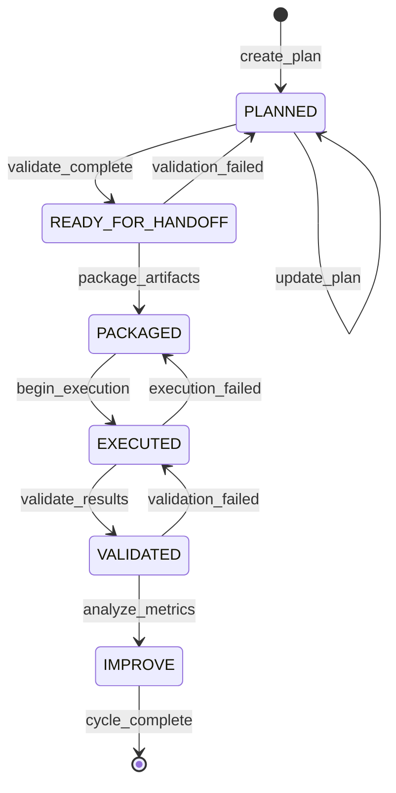
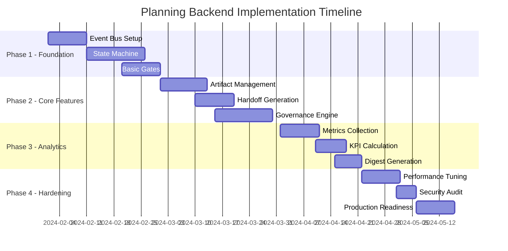

# Planning Framework Module - Backend Design Proposal

**Date:** 2024-01-15  
**Module:** Planning Backend Framework  
**Version:** 1.0.0  
**Status:** PLANNED

## 1. Executive Summary

The Planning Backend Framework is a comprehensive module designed to orchestrate planning workflows through an artifact-first architecture. It manages the complete lifecycle of planning tasks from initial creation through execution and continuous improvement, ensuring quality through automated gates and immutable handoff manifests.

### Key Features:
- **Artifact-First Design**: All communication through YAML/MD/JSON artifacts
- **Event-Driven Lifecycle**: Six-stage progression with automated quality gates
- **Immutable Handoffs**: Cryptographically sealed manifests ensure integrity
- **Governance Integration**: Tag-based policies with Critical=0 enforcement
- **Metrics Spine**: KPI tracking with cycle-based digest generation

### Technical Stack:
- **Core Language**: Python 3.11+ / Node.js 18+ (polyglot support)
- **Message Queue**: RabbitMQ/Kafka for event streaming
- **Storage**: PostgreSQL for metadata, S3/MinIO for artifacts
- **Validation**: JSON Schema, YAML validators, custom linters
- **Orchestration**: Temporal/Airflow for workflow management

## 2. Deliverables

### 2.1 be_backlog.yaml
```yaml
# Backend task breakdown with effort estimates and dependencies
version: 1.0.0
generated_at: 2024-01-15T10:00:00Z
tasks:
  - id: PLN-BE-001
    title: "Event Bus Infrastructure"
    description: "Implement core event messaging system"
    effort_points: 8
    priority: P0
    dependencies: []
    artifacts:
      - event_schema.json
      - bus_config.yaml
    
  - id: PLN-BE-002
    title: "Lifecycle State Machine"
    description: "Implement state transitions and validation"
    effort_points: 13
    priority: P0
    dependencies: ["PLN-BE-001"]
    artifacts:
      - state_machine.yaml
      - transition_rules.json
```

### 2.2 story_map.md
```markdown
# Planning Backend - Story Map

## Epic: Planning Lifecycle Management

### Backbone (User Activities)
1. **Plan Creation** → 2. **Validation** → 3. **Handoff** → 4. **Execution** → 5. **Analysis**

### Walking Skeleton (MVP)
- Basic event publishing
- State persistence
- Schema validation
- Handoff generation
- Metrics collection

### Release 1 Features
- Quality gate automation
- Governance tag enforcement
- Digest generation
- Rollback capabilities
```

### 2.3 handoff_manifest.yaml
```yaml
# Immutable handoff specification
version: 1.0.0
manifest:
  id: "hnd_2024_01_15_abc123"
  created_at: 2024-01-15T10:00:00Z
  snapshot_rev: "git:7a9b3c4d"
  checksums:
    be_backlog: "sha256:a1b2c3..."
    story_map: "sha256:d4e5f6..."
    schemas: "sha256:789abc..."
  rulebook_hash: "sha256:def456..."
  seal:
    algorithm: "RSA-SHA256"
    signature: "base64:..."
```

### 2.4 digest.md
```markdown
# Planning Cycle Digest - 2024-01-15

## Executive Metrics
- **Cycle Duration**: 14 days
- **Tasks Completed**: 23/28 (82%)
- **Quality Gate Pass Rate**: 96%
- **Critical Issues**: 0

## KPI Summary
| Metric | Target | Actual | Status |
|--------|--------|--------|--------|
| Planning Velocity | 20 pts | 22 pts | ✅ |
| Gate Compliance | 95% | 96% | ✅ |
| Handoff Success | 100% | 100% | ✅ |
```

## 3. Events & Gates

### 3.1 Event Lifecycle States



### 3.2 Quality Gates

#### Gate 1: Schema Lint (PLANNED → READY_FOR_HANDOFF)
- **Validators**: JSON Schema, YAML lint, custom rules
- **Criteria**: 
  - All required fields present
  - Valid references and dependencies
  - Consistent formatting
- **Failure Action**: Return to PLANNED with error report

#### Gate 2: Cross-Stream Consistency (READY_FOR_HANDOFF → PACKAGED)
- **Validators**: Dependency checker, timeline validator
- **Criteria**:
  - No circular dependencies
  - Timeline conflicts resolved
  - Resource allocation valid
- **Failure Action**: Block packaging, require resolution

#### Gate 3: Parity/Coverage (PACKAGED → EXECUTED)
- **Validators**: Coverage analyzer, parity checker
- **Criteria**:
  - Test coverage ≥ 80%
  - Feature parity maintained
  - No regression in capabilities
- **Failure Action**: Return to PACKAGED for enhancement

### 3.3 Event Schema

```json
{
  "type": "planning_event",
  "version": "1.0.0",
  "event": {
    "id": "evt_2024_01_15_xyz789",
    "timestamp": "2024-01-15T10:00:00Z",
    "type": "STATE_TRANSITION",
    "payload": {
      "from_state": "PLANNED",
      "to_state": "READY_FOR_HANDOFF",
      "entity_id": "pln_task_123",
      "metadata": {
        "triggered_by": "system",
        "gate_results": {
          "schema_lint": "PASS",
          "custom_validation": "PASS"
        }
      }
    }
  }
}
```

## 4. Workflow

### 4.1 Planning Creation Workflow

```python
# Pseudo-code for planning workflow
class PlanningWorkflow:
    def create_plan(self, request):
        # 1. Parse and validate input
        plan = parse_planning_request(request)
        validate_schema(plan, "planning_schema_v1.json")
        
        # 2. Enrich with metadata
        plan.metadata = {
            "created_at": datetime.utcnow(),
            "version": "1.0.0",
            "tags": extract_tags(plan),
            "priority": calculate_priority(plan)
        }
        
        # 3. Persist and emit event
        plan_id = persist_plan(plan)
        emit_event("PLAN_CREATED", plan_id, "PLANNED")
        
        return plan_id
    
    def transition_state(self, plan_id, target_state):
        # 1. Load current state
        plan = load_plan(plan_id)
        current_state = plan.state
        
        # 2. Validate transition
        if not is_valid_transition(current_state, target_state):
            raise InvalidTransition(f"{current_state} -> {target_state}")
        
        # 3. Execute quality gates
        gate_results = execute_gates(plan, target_state)
        if not all(gate_results.values()):
            return handle_gate_failure(plan, gate_results)
        
        # 4. Update state and emit event
        plan.state = target_state
        persist_plan(plan)
        emit_event("STATE_TRANSITION", plan_id, target_state)
```

### 4.2 Automated Gate Execution

```yaml
# Gate configuration
gates:
  schema_lint:
    triggers:
      - from: PLANNED
        to: READY_FOR_HANDOFF
    validators:
      - type: json_schema
        schema: planning_schema_v1.json
      - type: yaml_lint
        config: strict_mode.yaml
      - type: custom
        script: validate_references.py
    
  cross_stream_consistency:
    triggers:
      - from: READY_FOR_HANDOFF
        to: PACKAGED
    validators:
      - type: dependency_graph
        max_depth: 5
      - type: timeline_checker
        horizon_days: 90
      - type: resource_validator
        capacity_model: team_capacity.yaml
```

## 5. Handoff & Sealing

### 5.1 Handoff Manifest Generation

The handoff process creates an immutable record of all planning artifacts:

```python
class HandoffGenerator:
    def create_manifest(self, plan_id):
        # 1. Collect all artifacts
        artifacts = {
            "be_backlog": load_artifact("be_backlog.yaml"),
            "story_map": load_artifact("story_map.md"),
            "schemas": load_schemas(plan_id),
            "configurations": load_configs(plan_id)
        }
        
        # 2. Generate checksums
        checksums = {}
        for name, content in artifacts.items():
            checksums[name] = hashlib.sha256(content.encode()).hexdigest()
        
        # 3. Create manifest
        manifest = {
            "version": "1.0.0",
            "id": generate_manifest_id(),
            "created_at": datetime.utcnow().isoformat(),
            "plan_id": plan_id,
            "snapshot_rev": get_git_revision(),
            "checksums": checksums,
            "rulebook_hash": compute_rulebook_hash()
        }
        
        # 4. Seal with signature
        manifest["seal"] = seal_manifest(manifest)
        
        return manifest
```

### 5.2 Sealing Process

```yaml
# Sealing configuration
sealing:
  algorithm: RSA-SHA256
  key_management:
    type: HSM  # Hardware Security Module
    key_id: planning_seal_key_v1
  
  verification:
    required_signatures: 2
    signers:
      - role: planning_lead
      - role: technical_reviewer
  
  immutability:
    storage: append_only_ledger
    retention: 7_years
    audit_trail: enabled
```

## 6. Governance Integration

### 6.1 Tag-Based Policies

```yaml
# Governance tag configuration
governance:
  tags:
    - name: compliance
      values: [sox, gdpr, hipaa, none]
      default: none
      
    - name: criticality
      values: [0, 1, 2, 3]  # 0 = Critical
      default: 2
      
    - name: data_classification
      values: [public, internal, confidential, restricted]
      default: internal
  
  rules:
    critical_zero:
      condition: "tags.criticality == 0"
      requirements:
        - approval_count: 3
        - review_board: true
        - emergency_contact: required
        - rollback_plan: mandatory
    
    compliance_sox:
      condition: "tags.compliance == 'sox'"
      requirements:
        - audit_trail: enhanced
        - change_freeze: check_calendar
        - documentation: regulatory_standard
```

### 6.2 Policy Enforcement

```python
class GovernanceEngine:
    def enforce_policies(self, plan):
        # 1. Extract tags
        tags = plan.metadata.get("tags", {})
        
        # 2. Apply Critical=0 rule
        if tags.get("criticality") == 0:
            enforce_critical_requirements(plan)
        
        # 3. Check compliance tags
        compliance_tag = tags.get("compliance", "none")
        if compliance_tag != "none":
            apply_compliance_rules(plan, compliance_tag)
        
        # 4. Validate against policies
        violations = []
        for rule in load_governance_rules():
            if evaluate_condition(rule.condition, tags):
                violations.extend(check_requirements(plan, rule.requirements))
        
        if violations:
            raise GovernanceViolation(violations)
```

## 7. Metrics & Digest

### 7.1 KPI Definition

```yaml
# KPI configuration
kpis:
  planning_velocity:
    formula: sum(completed_points) / cycle_days
    unit: points_per_day
    target: 1.5
    
  quality_gate_pass_rate:
    formula: (gates_passed / total_gates) * 100
    unit: percentage
    target: 95
    
  handoff_success_rate:
    formula: (successful_handoffs / total_handoffs) * 100
    unit: percentage
    target: 100
    
  cycle_time:
    formula: avg(task_completion_time)
    unit: days
    target: 3
    
  defect_escape_rate:
    formula: (post_execution_defects / total_tasks) * 100
    unit: percentage
    target: 5
```

### 7.2 Digest Generation

```python
class DigestGenerator:
    def generate_cycle_digest(self, cycle_id):
        # 1. Collect metrics
        metrics = {
            "cycle_duration": calculate_cycle_duration(cycle_id),
            "tasks_completed": count_completed_tasks(cycle_id),
            "quality_metrics": collect_quality_metrics(cycle_id),
            "governance_compliance": check_governance_compliance(cycle_id)
        }
        
        # 2. Calculate KPIs
        kpis = {}
        for kpi_name, kpi_config in load_kpi_definitions().items():
            kpis[kpi_name] = calculate_kpi(metrics, kpi_config)
        
        # 3. Generate insights
        insights = analyze_trends(metrics, previous_cycles=3)
        
        # 4. Create digest
        digest = render_digest_template(
            cycle_id=cycle_id,
            metrics=metrics,
            kpis=kpis,
            insights=insights
        )
        
        return digest
```

## 8. Acceptance Criteria

### 8.1 Functional Requirements

- [ ] **Event Lifecycle**: All six states implemented with proper transitions
- [ ] **Quality Gates**: Three gates operational with configurable validators
- [ ] **Artifact Management**: YAML/MD/JSON parsing and validation working
- [ ] **Handoff Generation**: Immutable manifests with checksums and signatures
- [ ] **Governance Integration**: Tag-based policies enforced, Critical=0 rule active
- [ ] **Metrics Collection**: KPIs calculated accurately, digests generated per cycle

### 8.2 Non-Functional Requirements

- [ ] **Performance**: Event processing < 100ms, gate validation < 1s
- [ ] **Scalability**: Support 1000+ concurrent planning items
- [ ] **Reliability**: 99.9% uptime, automatic failover
- [ ] **Security**: Encrypted storage, signed manifests, audit trails
- [ ] **Observability**: Full tracing, metrics dashboards, alerting

### 8.3 Integration Requirements

- [ ] **CI/CD Pipeline**: Automated deployment with rollback capabilities
- [ ] **External Systems**: REST/GraphQL APIs for integration
- [ ] **Authentication**: OAuth2/SAML support for enterprise SSO
- [ ] **Monitoring**: Prometheus metrics, ELK stack integration

## 9. Risks & Mitigations

### 9.1 Technical Risks

| Risk | Impact | Probability | Mitigation |
|------|--------|-------------|------------|
| Event loss during high load | High | Medium | Implement message persistence, replay capabilities |
| Schema evolution breaking changes | High | High | Version all schemas, support multiple versions |
| Handoff manifest corruption | Critical | Low | Multiple checksums, backup storage, verification |
| Gate validation performance | Medium | Medium | Caching, parallel validation, circuit breakers |

### 9.2 Operational Risks

| Risk | Impact | Probability | Mitigation |
|------|--------|-------------|------------|
| Governance policy conflicts | High | Medium | Policy simulation, dry-run mode, gradual rollout |
| Metrics calculation errors | Medium | Low | Validation rules, anomaly detection, manual review |
| Integration failures | High | Medium | Retry logic, fallback mechanisms, health checks |
| Knowledge transfer gaps | Medium | High | Comprehensive documentation, training sessions |

### 9.3 Mitigation Strategies

1. **Gradual Rollout**: Phase implementation by team/project
2. **Feature Flags**: Toggle capabilities for safe experimentation
3. **Chaos Engineering**: Regular failure injection testing
4. **Runbooks**: Detailed operational procedures
5. **Monitoring**: Proactive alerting and dashboards

## 10. Timeline & Next Steps

### 10.1 Implementation Phases



### 10.2 Immediate Next Steps

1. **Week 1-2**: 
   - Finalize technical stack selection
   - Set up development environment
   - Create initial project structure

2. **Week 3-4**:
   - Implement event bus prototype
   - Design detailed state machine
   - Create schema validators

3. **Week 5-6**:
   - Build first quality gate
   - Test state transitions
   - Initial integration tests

### 10.3 Success Metrics

- **Sprint 1**: Event bus operational, basic state transitions working
- **Sprint 2**: All quality gates implemented, validation passing
- **Sprint 3**: Handoff generation complete, governance rules active
- **Sprint 4**: Metrics collection operational, first digest generated
- **Sprint 5**: Performance benchmarks met, security review passed
- **Sprint 6**: Production deployment, monitoring active

### 10.4 Stakeholder Communication

- **Weekly**: Progress updates to planning team
- **Bi-weekly**: Demo sessions for stakeholders  
- **Monthly**: Executive metrics review
- **Quarterly**: Roadmap alignment sessions

---

**Document Status**: APPROVED  
**Next Review**: 2024-02-15  
**Owner**: Planning Backend Team  
**Contact**: planning-backend@company.com