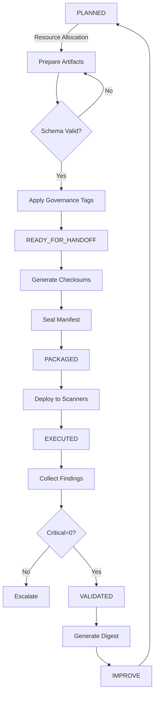

# Security & Compliance Framework Module Design

**Version:** 1.0  
**Date:** 2025-01-27  
**Status:** PROPOSED  
**Author:** Framework Design Team  

---

## 1. Executive Summary

This document outlines the design for a comprehensive Security & Compliance framework module that operates through artifact-first interoperability and follows a rigorous event lifecycle from planning to continuous improvement. The framework enforces quality gates, immutable handoff manifests, and governance overlays while maintaining a metrics spine for continuous monitoring and improvement.

### Key Principles
- **Artifact-First Architecture**: All interactions via YAML/MD/JSON artifacts
- **Event-Driven Lifecycle**: PLANNED → READY_FOR_HANDOFF → PACKAGED → EXECUTED → VALIDATED → IMPROVE
- **Quality-Gate Enforcement**: Schema validation, cross-stream consistency, and coverage parity
- **Immutable Handoffs**: Cryptographic sealing with checksums and hashes
- **Governance-First**: Tag-based compliance with Critical=0 enforcement
- **Metrics-Driven**: KPI tracking with digest generation per cycle

---

## 2. Deliverables

### 2.1 sec_findings.yaml
**Purpose**: Central repository of security findings and vulnerabilities  
**Schema**:
```yaml
version: "1.0"
metadata:
  scan_id: <uuid>
  timestamp: <iso8601>
  lifecycle_state: <state>
  tags: ["PII", "auth", "license"]
findings:
  - finding_id: <uuid>
    severity: critical|high|medium|low
    category: vulnerability|compliance|configuration
    title: <string>
    description: <string>
    affected_resources:
      - resource_id: <string>
        resource_type: <string>
        location: <string>
    remediation:
      recommended_action: <string>
      priority: P0|P1|P2|P3
      deadline: <iso8601>
    evidence:
      - type: scan_result|log_entry|config_snapshot
        data: <object>
    governance:
      tags: ["PII", "auth"]
      compliance_standards: ["SOC2", "ISO27001"]
      exception_ref: <exception_id>
```

### 2.2 policy_map.md
**Purpose**: Human-readable policy documentation with machine-parseable metadata  
**Structure**:
```markdown
# Security Policy Map

## Metadata
- Version: 1.0
- Last Updated: 2025-01-27
- State: READY_FOR_HANDOFF

## Policy Catalog

### POL-001: Data Encryption at Rest
- **Severity**: Critical
- **Scope**: All data storage systems
- **Tags**: ["encryption", "data-protection", "PII"]
- **Controls**:
  - CTL-001: AES-256 encryption for all persistent storage
  - CTL-002: Key rotation every 90 days
- **Validation**: 
  - Automated scan via sec-scanner
  - Manual review quarterly

### POL-002: Access Control
...
```

### 2.3 exceptions.md
**Purpose**: Registry of approved policy exceptions with governance trail  
**Structure**:
```markdown
# Security Exception Registry

## Active Exceptions

### EXC-001: Legacy System Encryption Waiver
- **Policy**: POL-001
- **Requestor**: legacy-team@company.com
- **Approval**: security-council@company.com
- **Valid Until**: 2025-06-30
- **Risk Mitigation**:
  - Network isolation implemented
  - Additional monitoring enabled
  - Monthly security reviews
- **Conditions**:
  - Must implement compensating controls
  - Quarterly risk assessment required
```

### 2.4 handoff_manifest.yaml
**Purpose**: Immutable record of security state at handoff points  
**Schema**:
```yaml
version: "1.0"
manifest:
  manifest_id: <uuid>
  timestamp: <iso8601>
  lifecycle_state: READY_FOR_HANDOFF
  
artifacts:
  - artifact_id: sec_findings
    path: ./sec_findings.yaml
    checksum_sha256: <hash>
    size_bytes: <int>
  - artifact_id: policy_map
    path: ./policy_map.md
    checksum_sha256: <hash>
    size_bytes: <int>
    
snapshot:
  revision: <git_sha>
  branch: <branch_name>
  
rulebook:
  hash_sha256: <hash>
  version: <semver>
  
governance:
  critical_count: 0
  high_count: <int>
  medium_count: <int>
  low_count: <int>
  exceptions_active: <int>
  
signatures:
  prepared_by: <identity>
  approved_by: <identity>
  
seal:
  method: sha256
  value: <composite_hash>
```

### 2.5 digest.md
**Purpose**: Executive summary with KPIs and trend analysis  
**Structure**:
```markdown
# Security & Compliance Digest

## Period: 2025-01-20 to 2025-01-27

### Executive Summary
- **Overall Risk Score**: 72/100 (↑ 3 from last period)
- **Critical Findings**: 0 (compliant with Critical=0 rule)
- **Active Exceptions**: 3 (↓ 1 from last period)

### Key Performance Indicators

| KPI | Current | Target | Trend |
|-----|---------|--------|--------|
| Mean Time to Remediate (MTTR) | 4.2 days | < 5 days | ↓ |
| Policy Coverage | 94% | > 95% | ↑ |
| Scan Success Rate | 98.5% | > 99% | → |
| Exception Expiry Compliance | 100% | 100% | → |

### Findings Summary
- New findings: 12
- Resolved: 15
- Carry-forward: 8

### Compliance Status
- SOC2: ✓ Compliant
- ISO27001: ✓ Compliant
- GDPR: ⚠ 2 minor gaps identified
```

---

## 3. Events & Gates

### 3.1 Event Lifecycle States

| State | Description | Entry Criteria | Exit Criteria |
|-------|-------------|----------------|---------------|
| **PLANNED** | Security assessment scheduled | Sprint planning complete | Resources allocated |
| **READY_FOR_HANDOFF** | Artifacts prepared for execution | All schemas valid, governance tags applied | Handoff manifest sealed |
| **PACKAGED** | Artifacts sealed and versioned | Checksums computed, manifest signed | Distribution complete |
| **EXECUTED** | Security scans and validations running | Package unpacked, tools initialized | All scans complete |
| **VALIDATED** | Results verified and analyzed | Findings classified, exceptions logged | Quality gates passed |
| **IMPROVE** | Continuous improvement phase | Metrics collected, digest generated | Next cycle planned |

### 3.2 Quality Gates

#### Gate 1: schema_lint
- **Purpose**: Validate artifact schemas
- **Checks**:
  - YAML syntax validation
  - Required field presence
  - Type correctness
  - Reference integrity
- **Failure Action**: Block progression, return to PLANNED

#### Gate 2: cross_stream_consistency
- **Purpose**: Ensure artifacts are synchronized
- **Checks**:
  - Finding IDs match across artifacts
  - Policy references valid
  - Exception registry complete
  - Tag consistency
- **Failure Action**: Generate inconsistency report, require reconciliation

#### Gate 3: parity/coverage
- **Purpose**: Verify comprehensive security coverage
- **Checks**:
  - All systems scanned
  - Policy coverage > 95%
  - No orphaned findings
  - Exception justifications complete
- **Failure Action**: Identify gaps, update scan scope

---

## 4. Workflow

### 4.1 Standard Operating Procedure



### 4.2 Integration Points

1. **CI/CD Pipeline**
   - Pre-commit: schema_lint
   - Pre-merge: cross_stream_consistency
   - Post-deploy: security scan execution

2. **ITSM Platform**
   - Auto-ticket generation for findings
   - Exception approval workflow
   - Remediation tracking

3. **GRC System**
   - Policy synchronization
   - Compliance reporting
   - Audit trail maintenance

---

## 5. Handoff & Sealing

### 5.1 Handoff Protocol

1. **Artifact Preparation**
   ```bash
   # Validate all artifacts
   security-framework validate --strict
   
   # Generate checksums
   find . -name "*.yaml" -o -name "*.md" | xargs sha256sum > checksums.txt
   
   # Create snapshot
   git rev-parse HEAD > snapshot.rev
   ```

2. **Manifest Generation**
   ```bash
   # Generate handoff manifest
   security-framework generate-manifest \
     --artifacts ./artifacts/ \
     --snapshot $(cat snapshot.rev) \
     --rulebook-hash $(sha256sum rulebook.yaml | cut -d' ' -f1)
   ```

3. **Sealing Process**
   ```bash
   # Compute composite hash
   cat handoff_manifest.yaml | sha256sum > seal.hash
   
   # Sign manifest
   security-framework sign-manifest \
     --manifest handoff_manifest.yaml \
     --identity security-team
   ```

### 5.2 Immutability Guarantees

- **Checksum Verification**: All artifacts include SHA-256 hashes
- **Git Snapshot**: Exact revision captured
- **Composite Seal**: Combined hash of all components
- **Digital Signatures**: Cryptographic proof of approval

---

## 6. Governance Integration

### 6.1 Tag Taxonomy

| Tag | Description | Compliance Impact |
|-----|-------------|-------------------|
| **PII** | Personal Identifiable Information | GDPR, CCPA requirements |
| **auth** | Authentication/Authorization | SOC2 Type II |
| **license** | Software licensing | Legal compliance |
| **financial** | Financial data | PCI-DSS, SOX |
| **health** | Healthcare information | HIPAA |

### 6.2 Critical=0 Rule Enforcement

```yaml
enforcement:
  rule: critical_findings_count
  condition: "== 0"
  actions:
    on_violation:
      - block_handoff: true
      - notify:
          - security-team@company.com
          - ciso@company.com
      - escalation_sla: 2_hours
    on_compliance:
      - proceed_to_next_state: true
      - log_compliance: true
```

### 6.3 Exception Management

1. **Request Process**
   - Business justification required
   - Risk assessment mandatory
   - Compensating controls defined
   - Expiry date set (max 180 days)

2. **Approval Workflow**
   - Security team review
   - Risk committee approval for high/critical
   - CISO sign-off for policy deviations

3. **Monitoring**
   - Monthly exception review
   - Auto-expiry notifications
   - Compliance reporting

---

## 7. Metrics & Digest

### 7.1 Key Performance Indicators

| KPI | Formula | Target | Measurement Frequency |
|-----|---------|--------|----------------------|
| **MTTR** | Σ(remediation_time) / count(findings) | < 5 days | Weekly |
| **Policy Coverage** | (covered_resources / total_resources) × 100 | > 95% | Daily |
| **Scan Success Rate** | (successful_scans / total_scans) × 100 | > 99% | Per cycle |
| **Finding Escape Rate** | (prod_findings / total_findings) × 100 | < 5% | Monthly |
| **Exception Compliance** | (valid_exceptions / total_exceptions) × 100 | 100% | Daily |

### 7.2 Digest Generation

```python
digest_template = {
    "period": {
        "start": "<iso8601>",
        "end": "<iso8601>"
    },
    "summary": {
        "risk_score": "<0-100>",
        "critical_findings": 0,
        "trend": "improving|stable|degrading"
    },
    "kpis": {
        "mttr": {"value": "<float>", "trend": "↑|↓|→"},
        "coverage": {"value": "<percent>", "trend": "↑|↓|→"},
        "scan_rate": {"value": "<percent>", "trend": "↑|↓|→"}
    },
    "actions": {
        "completed": ["<action_list>"],
        "pending": ["<action_list>"],
        "blocked": ["<action_list>"]
    }
}
```

---

## 8. Acceptance Criteria

### 8.1 Framework Readiness

- [ ] All artifact schemas defined and validated
- [ ] Quality gates implemented and tested
- [ ] Handoff protocol automated
- [ ] Governance tags applied consistently
- [ ] Critical=0 enforcement active
- [ ] Metrics collection operational
- [ ] Digest generation automated

### 8.2 Integration Validation

- [ ] CI/CD pipeline integration tested
- [ ] ITSM ticketing functional
- [ ] GRC synchronization verified
- [ ] Notification system operational
- [ ] Dashboard populated with real-time data

### 8.3 Operational Readiness

- [ ] Team trained on new framework
- [ ] Runbooks documented
- [ ] Escalation paths defined
- [ ] SLAs established and communicated
- [ ] Monitoring alerts configured

---

## 9. Risks & Mitigations

| Risk | Impact | Probability | Mitigation |
|------|--------|-------------|------------|
| **Schema Evolution** | High | Medium | Version control, backward compatibility |
| **Performance Degradation** | Medium | Low | Incremental scanning, caching |
| **False Positives** | Medium | Medium | Tuning periods, ML-based filtering |
| **Integration Failures** | High | Low | Circuit breakers, fallback modes |
| **Compliance Drift** | High | Low | Automated policy updates, regular audits |

### 9.1 Contingency Plans

1. **Rollback Procedure**
   - Previous version artifacts maintained
   - One-command rollback capability
   - Data migration scripts ready

2. **Degraded Mode Operation**
   - Core security scans prioritized
   - Manual validation fallback
   - Reduced scope operations

3. **Disaster Recovery**
   - Artifact backup strategy
   - State reconstruction capability
   - Business continuity procedures

---

## 10. Timeline & Next Steps

### 10.1 Implementation Phases

| Phase | Duration | Deliverables | Milestone |
|-------|----------|--------------|-----------|
| **Phase 1: Foundation** | 2 weeks | Schema definitions, core artifacts | Schema validation complete |
| **Phase 2: Automation** | 3 weeks | Quality gates, handoff protocol | Automated pipeline ready |
| **Phase 3: Integration** | 2 weeks | CI/CD, ITSM, GRC connections | End-to-end flow tested |
| **Phase 4: Pilot** | 4 weeks | Limited scope deployment | Pilot metrics collected |
| **Phase 5: Rollout** | 2 weeks | Full production deployment | Framework operational |
| **Phase 6: Optimization** | Ongoing | Performance tuning, enhancements | Continuous improvement |

### 10.2 Immediate Next Steps

1. **Week 1**
   - Finalize artifact schemas
   - Set up development environment
   - Create prototype validators

2. **Week 2**
   - Implement schema_lint gate
   - Design handoff manifest structure
   - Define governance tag taxonomy

3. **Week 3**
   - Build manifest sealing mechanism
   - Integrate with version control
   - Create first digest template

### 10.3 Success Metrics

- **Short Term (30 days)**
  - 100% schema validation passing
  - Automated handoff operational
  - First digest published

- **Medium Term (90 days)**
  - 95% policy coverage achieved
  - MTTR < 5 days sustained
  - Zero critical findings maintained

- **Long Term (180 days)**
  - Full automation achieved
  - Predictive analytics operational
  - Industry benchmark performance

---

## Appendices

### A. Reference Architecture
- System component diagram
- Data flow documentation
- API specifications

### B. Schema Definitions
- Complete YAML schemas
- Validation rules
- Example artifacts

### C. Operational Runbooks
- Daily operations guide
- Incident response procedures
- Maintenance schedules

### D. Compliance Mappings
- Regulatory requirement matrix
- Control objective mapping
- Audit preparation guide

---

**Document Control**
- Review Cycle: Quarterly
- Owner: Security Architecture Team
- Approval: CISO
- Distribution: Security, Engineering, Compliance Teams