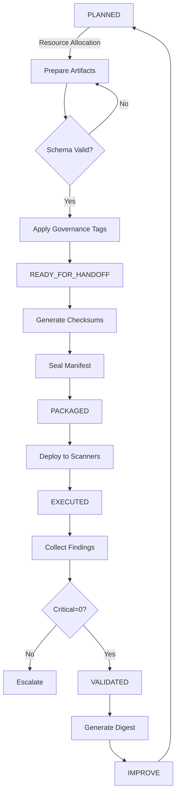

## Cycle Digest — 2025-09-02

- Cycle: 2025-09
- Snapshot Rev: git:abcdef1234
- Rulebook Hash: sha256:rulebookhashhere

### KPI Summary
- Time to VALIDATED: TBD
- Gate pass rate: schema_lint TBD, consistency TBD, parity/coverage TBD
- Critical at PACKAGED: TBD → at VALIDATED: TBD
- Exceptions: new TBD, active TBD, expired TBD
- Coverage: TBD of required streams

### Gate Outcomes
- schema_lint: TBD
- cross_stream_consistency: TBD
- parity/coverage: TBD

### Exceptions Summary
- List active and new exceptions with scope and expiry.

### Top Risks & Actions
- Summarize top risks and assigned actions.


---


## Security & Compliance Framework Module — Design Proposal

- Date: 2025-09-02
- Version: v0.1 (proposal)
- Owners: Security Engineering, Compliance, Platform
- Scope: Cross-repo, artifact-first, event-driven Security & Compliance (S&C) framework

## 1) Executive Summary

This proposal defines an artifact-first, event-driven Security & Compliance framework that standardizes how security findings, policies, exceptions, and handoffs are authored, validated, sealed, and measured across product streams. The design centers on machine-readable artifacts (YAML/MD/JSON) and a deterministic event lifecycle with quality gates to ensure consistency and enforce governance.

Key elements:
- Artifact-first interop: All outcomes are materialized as versioned text artifacts (YAML/MD/JSON).
- Event lifecycle: PLANNED → READY_FOR_HANDOFF → PACKAGED → EXECUTED → VALIDATED → IMPROVE.
- Quality gates: schema_lint, cross_stream_consistency, parity/coverage.
- Immutable handoff manifest: cryptographic checksums, snapshot_rev, rulebook_hash.
- Governance overlay: tags[] (PII, auth, license, etc.), Critical=0 rule, exception registry.
- Metrics spine: KPIs with a digest file per cycle for leadership and audit.

Outcomes: predictable handoffs, auditable artifacts, consistent governance, measurable performance, and continuous improvement.

## 2) Deliverables

Authoritative artifacts for each cycle (stored under repo-controlled directories, versioned in VCS):

- sec_findings.yaml: Canonical record of findings for the cycle.
- policy_map.md: Human-readable mapping from policies/controls to rules, tags, and owners.
- exceptions.md: Exception registry with approvals, scope, and expiry.
- handoff_manifest.yaml: Immutable manifest sealing the cycle handoff.
- digest.md: Metrics digest summarizing KPIs and gate outcomes.

Suggested default locations:
- Security reviews (proposal): `reports/agent_reviews/security/<date>-proposal.md`
- Findings: `frameworks/security/artifacts/<cycle>/sec_findings.yaml`
- Policy map: `frameworks/security/policy/policy_map.md`
- Exceptions: `frameworks/security/policy/exceptions.md`
- Handoff manifest: `frameworks/security/manifests/<cycle>/handoff_manifest.yaml`
- Digest: `frameworks/security/digests/<date>-digest.md`

Example schema (sec_findings.yaml):
```yaml
schema_version: 1.0
run_id: 2025-09-02.01
snapshot_rev: "git:abcdef1234"              # Git snapshot or content-addressed ref
rulebook_hash: "sha256:..."                 # Hash of rulebook used during evaluation
stream: "payments-service"
cycle: "2025-09"
owners:
  - team: "payments-sec"
  - team: "app-platform"
tags: [PII, auth]
findings:
  - id: F-0001
    title: "PII in logs"
    severity: Critical
    category: data_exposure
    tags: [PII, logging]
    status: Open
    evidence_uri: s3://bucket/logs/sample
    first_seen: 2025-08-28
    last_seen: 2025-09-02
    affected_assets: ["payments-api", "worker-ingest"]
    controls: [LOG-RED-001, DLP-002]
    references: [CWE-312]
  - id: F-0002
    title: "Missing license header"
    severity: Low
    category: license
    tags: [license]
    status: Resolved
```

Example content (policy_map.md):
```md
# Policy → Rules → Tags → Owners

- LOG-RED-001
  - Purpose: Redact PII in logs
  - Rules: [rule:regex_pii_redaction, rule:log_sink_blocklist]
  - Tags: [PII, logging]
  - Owners: security-observability@company

- DLP-002
  - Purpose: Prevent sensitive exfiltration
  - Rules: [rule:egress_dlp_scan]
  - Tags: [PII, egress]
  - Owners: data-security@company
```

Example content (exceptions.md):
```md
# Exceptions Registry

- EX-001
  - Scope: payments-service/log-sanitizer
  - Related Findings: [F-0001]
  - Justification: Redaction rollout in progress
  - Risk: Medium
  - Temporary Compensating Controls: log sampling + alerting
  - Approved By: CISO (sig: sha256:...)
  - Requested: 2025-09-02, Expires: 2025-10-15
```

Example schema (handoff_manifest.yaml):
```yaml
manifest_version: 1
cycle: "2025-09"
snapshot_rev: "git:abcdef1234"
rulebook_hash: "sha256:..."
artifacts:
  - name: sec_findings
    path: frameworks/security/artifacts/2025-09/sec_findings.yaml
    sha256: "..."
  - name: policy_map
    path: frameworks/security/policy/policy_map.md
    sha256: "..."
  - name: exceptions
    path: frameworks/security/policy/exceptions.md
    sha256: "..."
quality_gates:
  schema_lint: pass
  cross_stream_consistency: pass
  parity_coverage: pass
signing:
  signed_by: release-bot@company
  signature: "BASE64_SIGNATURE"
  signed_at: "2025-09-02T12:34:56Z"
```

## 3) Events & Gates

Event lifecycle and required gates:

- PLANNED
  - Inputs: backlog, last cycle digest, policy deltas
  - Outputs: scoped plan, owners, target KPIs
  - Exit gates: schema_lint(plan artifacts)

- READY_FOR_HANDOFF
  - Inputs: draft artifacts, exception requests
  - Outputs: candidate `sec_findings.yaml`, `policy_map.md`, `exceptions.md`
  - Exit gates: schema_lint(all), cross_stream_consistency

- PACKAGED
  - Inputs: frozen artifacts, reproducible build inputs
  - Outputs: pre-manifest artifact set
  - Exit gates: parity/coverage (across streams/services), schema_lint(all)

- EXECUTED
  - Inputs: packaged artifacts, automation runs
  - Outputs: evaluated findings, remediations, generated checksums
  - Exit gates: cross_stream_consistency (post-eval), schema_lint(findings)

- VALIDATED
  - Inputs: executed results, sign-offs
  - Outputs: immutable `handoff_manifest.yaml` (sealed)
  - Exit gates: Critical=0 (no Critical findings without time-bound exception), parity/coverage

- IMPROVE
  - Inputs: digest.md, retrospectives
  - Outputs: backlog updates, policy refinements
  - Exit gates: none; feeds next PLANNED

Gate definitions:
- schema_lint: Validate against JSON Schema/YAML meta-schema for all artifacts.
- cross_stream_consistency: Enforce shared constraints (e.g., severity scale, tag taxonomy, policy references) across streams.
- parity/coverage: Ensure required streams/services have artifacts; enforce coverage targets per policy.

## 4) Workflow

- Authoring
  - Security engineers author/update artifacts under `frameworks/security/...` in feature branches.
  - Use templates and schemas stored in-repo (see Acceptance Criteria).

- Automation
  - CI runs schema_lint on every change.
  - Nightly job checks cross_stream_consistency across all active streams.
  - Release pipeline enforces parity/coverage before PACKAGED.

- Reviews & Approvals
  - PRs require code owners from Security and the relevant service team.
  - Exceptions require approver signatures embedded in `exceptions.md` and captured in manifest.

- Versioning & Traceability
  - snapshot_rev pin on VALIDATED references commit SHA for all artifacts.
  - rulebook_hash pins the evaluation ruleset (content-addressed digest of rules).
  - Checksums ensure artifact immutability at handoff.

- Storage & Retention
  - Artifacts are committed to VCS; signed manifests are retained for ≥ 24 months.
  - Optional offsite store (e.g., object storage) mirrors sealed manifests and checksums.

## 5) Handoff & Sealing

- Assemble artifacts: `sec_findings.yaml`, `policy_map.md`, `exceptions.md`.
- Compute cryptographic checksums (sha256) over canonicalized content.
- Create `handoff_manifest.yaml` with: manifest_version, cycle, snapshot_rev, rulebook_hash, artifacts[], quality_gates, signing.
- Seal the handoff:
  - Write canonical file
  - Sign the manifest using organization key (Sigstore or X.509-based)
  - Store signature and signer identity in manifest
  - Treat the manifest as immutable; future changes require a superseding manifest

- Immutability guarantees:
  - Manifest path includes the cycle identifier
  - Checksums and snapshot_rev prevent content drift
  - CI prevents mutation to sealed manifests (write-protected path)

## 6) Governance Integration

- tags[] taxonomy
  - Standardized tags: PII, auth, license, infra, crypto, logging, egress, privacy, etc.
  - Each finding and policy maps to tags for reporting and routing.

- Critical=0 rule
  - VALIDATED requires zero Critical findings unless there is a time-bound, approved exception in `exceptions.md`.
  - If any Critical remains without exception, the handoff fails.

- Exception registry
  - All exceptions are recorded in `exceptions.md` with scope, justification, risk, controls, approver, and expiry.
  - CI verifies no expired exceptions cover open Critical findings.

- Policy governance
  - `policy_map.md` binds controls to rules and owners; changes require policy code owner review.

- Auditability
  - All governance decisions are captured as artifacts and sealed in `handoff_manifest.yaml`.

## 7) Metrics & Digest

KPIs (per cycle):
- Mean time to VALIDATED
- Gate pass rate by stage (schema_lint, cross_stream_consistency, parity/coverage)
- Open Critical at PACKAGED vs VALIDATED
- Exception count by severity and status (new/active/expired)
- Coverage parity across streams (% streams meeting required artifacts)
- Reopen rate (findings reopened after closure)

Digest file (`frameworks/security/digests/<date>-digest.md`) structure:
```md
## Cycle Digest — 2025-09-02

- Cycle: 2025-09
- Snapshot Rev: git:abcdef1234
- Rulebook Hash: sha256:...

### KPI Summary
- Time to VALIDATED: 6d
- Gate pass rate: schema_lint 100%, consistency 95%, parity/coverage 92%
- Critical at PACKAGED: 3 → at VALIDATED: 0
- Exceptions: 2 new, 1 active, 0 expired
- Coverage: 92% of required streams

### Gate Outcomes
- schema_lint: pass (all artifacts)
- cross_stream_consistency: 2 inconsistencies resolved
- parity/coverage: 3 streams below target; action items opened

### Exceptions Summary
- EX-001 (payments): approved, expires 2025-10-15

### Top Risks & Actions
- Log redaction rollout; action: enforce LOG-RED-001 by 2025-09-20
```

## 8) Acceptance Criteria

- Artifacts & Schemas
  - Templates for `sec_findings.yaml`, `policy_map.md`, `exceptions.md`, `handoff_manifest.yaml`, and `digest.md` exist and pass schema_lint.
  - CI job validates schema_lint on PRs touching security artifacts.

- Event Lifecycle & Gates
  - Pipeline implements lifecycle states with gate checks at transitions.
  - Failure of Critical=0 rule blocks VALIDATED and sealing.

- Immutability & Traceability
  - `handoff_manifest.yaml` includes snapshot_rev, rulebook_hash, and sha256 for all artifacts.
  - Sealed manifests are signed and protected against modification.

- Governance & Exceptions
  - tags[] taxonomy documented and enforced via lint.
  - Exceptions are validated for expiry and approver requirements.

- Metrics & Digest
  - Digest generation job writes `frameworks/security/digests/<date>-digest.md` each cycle.
  - KPIs computed and rendered; prior-cycle comparison supported.

## 9) Risks & Mitigations

- Cross-stream drift
  - Mitigation: nightly cross_stream_consistency checks; shared schema registry.

- Exception abuse
  - Mitigation: approval ladder, expiry, compensating controls required; surfaced in digest.

- Hash/signing errors
  - Mitigation: canonicalization, deterministic hashing, Sigstore-backed verification in CI.

- Coverage gaps
  - Mitigation: parity/coverage gate hard-fail, visible KPI in digest.

- False positives / developer friction
  - Mitigation: rule tuning with rulebook_hash versioning; quick exception workflow with expiry.

- Timeline risk
  - Mitigation: phase deliverables; focus on artifacts and gates first.

## 10) Timeline & Next Steps

Phase 1 (Week 1–2):
- Define schemas and templates; implement schema_lint job.
- Establish tags[] taxonomy and Critical=0 gate.

Phase 2 (Week 3–4):
- Implement cross_stream_consistency and parity/coverage checks.
- Create manifest sealer with checksums, snapshot_rev, rulebook_hash, and signing.

Phase 3 (Week 5–6):
- Wire pipeline stages to lifecycle; enforce gates.
- Generate first `digest.md`; run retrospective to populate IMPROVE.

Immediate next steps:
- Approve this design
- Create initial templates and schemas in `frameworks/security/`
- Stand up CI jobs for schema_lint and consistency checks
- Pilot on one stream (payments-service) before organization-wide rollout

---

References
- Control taxonomy, rulebook repository, and schema registry to be defined in Phase 1 and referenced via rulebook_hash and schema URLs.


---

# Security & Compliance Framework Digest

**Period:** 2025-01-27  
**Type:** Framework Design Baseline  
**Status:** INITIAL  

---

## Executive Summary

This digest establishes the baseline metrics and KPIs for the Security & Compliance Framework Module. As this is the initial design phase, all metrics represent target states and expected operational parameters once the framework is fully implemented.

### Framework Objectives
- **Primary Goal**: Achieve Critical=0 compliance with < 5 day MTTR
- **Coverage Target**: > 95% policy coverage across all systems
- **Automation Level**: 80% of security workflows automated
- **Quality Gates**: 100% artifact validation before handoff

---

## Key Performance Indicators (Baseline)

| KPI Category | Metric | Baseline Target | Measurement Method | Reporting Frequency |
|--------------|--------|-----------------|-------------------|---------------------|
| **Response Time** | Mean Time to Detect (MTTD) | < 1 hour | Automated scanning | Real-time |
| **Response Time** | Mean Time to Remediate (MTTR) | < 5 days | Issue tracking | Daily |
| **Coverage** | Policy Coverage Rate | > 95% | Asset inventory | Daily |
| **Coverage** | Scan Success Rate | > 99% | Scan logs | Per cycle |
| **Quality** | False Positive Rate | < 5% | Manual validation | Weekly |
| **Quality** | Finding Escape Rate | < 2% | Production incidents | Monthly |
| **Compliance** | Critical Findings | 0 | Finding severity | Real-time |
| **Compliance** | Exception Compliance | 100% | Exception registry | Daily |
| **Operational** | Automation Rate | > 80% | Workflow metrics | Weekly |
| **Operational** | Handoff Success Rate | > 99.5% | Manifest validation | Per handoff |

---

## Metrics Framework Design

### 1. Data Collection Architecture

```yaml
metrics_pipeline:
  sources:
    - security_scanners:
        frequency: continuous
        data_points: [findings, scan_duration, coverage]
    - artifact_validators:
        frequency: per_commit
        data_points: [schema_validity, consistency_score]
    - handoff_system:
        frequency: per_handoff
        data_points: [checksum_validity, seal_integrity]
    - exception_registry:
        frequency: daily
        data_points: [active_count, expiry_status, compliance]
        
  aggregation:
    - level_1: raw_metrics (1-minute retention: 7 days)
    - level_2: hourly_rollup (retention: 30 days)
    - level_3: daily_summary (retention: 365 days)
    - level_4: monthly_digest (retention: 7 years)
```

### 2. KPI Calculation Formulas

#### Response Metrics
```python
# Mean Time to Detect (MTTD)
mttd = sum(detection_time - vulnerability_introduction_time) / count(detected_vulnerabilities)

# Mean Time to Remediate (MTTR)
mttr = sum(remediation_time - detection_time) / count(remediated_findings)

# First Response Time
frt = sum(first_action_time - detection_time) / count(findings_with_action)
```

#### Coverage Metrics
```python
# Policy Coverage Rate
policy_coverage = (count(resources_with_policy) / count(total_resources)) * 100

# Scan Coverage Rate
scan_coverage = (count(scanned_resources) / count(scannable_resources)) * 100

# Control Effectiveness
control_effectiveness = (count(controls_preventing_issues) / count(total_controls)) * 100
```

#### Quality Metrics
```python
# False Positive Rate
false_positive_rate = (count(false_positives) / count(total_findings)) * 100

# Finding Accuracy
finding_accuracy = (count(true_positives) / (count(true_positives) + count(false_positives))) * 100

# Validation Success Rate
validation_rate = (count(validated_artifacts) / count(total_artifacts)) * 100
```

---

## Operational Metrics Design

### 1. Lifecycle State Metrics

| State | Duration Target | Alert Threshold | Escalation |
|-------|-----------------|-----------------|------------|
| PLANNED → READY_FOR_HANDOFF | < 2 hours | > 4 hours | Team Lead |
| READY_FOR_HANDOFF → PACKAGED | < 10 minutes | > 30 minutes | DevOps |
| PACKAGED → EXECUTED | < 1 hour | > 2 hours | Security Ops |
| EXECUTED → VALIDATED | < 4 hours | > 8 hours | Security Team |
| VALIDATED → IMPROVE | < 1 day | > 2 days | Management |

### 2. Quality Gate Performance

```yaml
quality_gates:
  schema_lint:
    pass_rate_target: > 99.9%
    avg_execution_time: < 5 seconds
    failure_categories:
      - syntax_error: < 0.1%
      - missing_required: < 0.05%
      - type_mismatch: < 0.05%
      
  cross_stream_consistency:
    pass_rate_target: > 99.5%
    avg_execution_time: < 30 seconds
    failure_categories:
      - reference_mismatch: < 0.3%
      - tag_inconsistency: < 0.2%
      
  parity_coverage:
    pass_rate_target: > 98%
    avg_execution_time: < 2 minutes
    failure_categories:
      - coverage_gap: < 1.5%
      - parity_violation: < 0.5%
```

---

## Governance Metrics

### 1. Compliance Tracking

| Standard | Target Compliance | Measurement Method | Review Frequency |
|----------|------------------|-------------------|------------------|
| SOC2 Type II | 100% | Control testing | Quarterly |
| ISO 27001 | 100% | Gap analysis | Semi-annual |
| GDPR | 100% | Data flow audit | Monthly |
| PCI-DSS | 100% | Scan validation | Quarterly |
| HIPAA | 100% | Access review | Monthly |

### 2. Exception Metrics

```yaml
exception_metrics:
  limits:
    max_active_exceptions: 10
    max_exception_duration: 180 days
    max_critical_exceptions: 0
    max_high_exceptions: 3
    
  tracking:
    avg_exception_duration: < 90 days
    exception_renewal_rate: < 20%
    compensating_control_coverage: 100%
    timely_review_rate: 100%
```

### 3. Tag Utilization

| Tag | Expected Usage | Coverage Target | Validation Method |
|-----|----------------|-----------------|-------------------|
| PII | 30-40% of resources | 100% | Data classification scan |
| auth | 20-30% of resources | 100% | Access control audit |
| license | 15-20% of resources | 100% | License scanner |
| financial | 10-15% of resources | 100% | Data flow analysis |
| health | 5-10% of resources | 100% | PHI scanner |

---

## Trend Analysis Framework

### 1. Leading Indicators

```yaml
leading_indicators:
  - vulnerability_introduction_rate:
      formula: new_vulnerabilities / code_changes
      target: decreasing
      alert: > 5% increase week-over-week
      
  - security_debt_ratio:
      formula: unresolved_findings / total_findings
      target: < 10%
      alert: > 15%
      
  - automation_adoption:
      formula: automated_remediations / total_remediations
      target: increasing
      alert: < 70%
```

### 2. Lagging Indicators

```yaml
lagging_indicators:
  - incident_rate:
      formula: security_incidents / time_period
      target: < 1 per month
      
  - compliance_violations:
      formula: audit_findings / audit_points
      target: 0
      
  - mean_time_between_failures:
      formula: operational_time / count(security_failures)
      target: > 30 days
```

---

## Digest Generation Specifications

### 1. Automated Digest Schedule

| Digest Type | Frequency | Recipients | Format |
|-------------|-----------|------------|---------|
| Daily Summary | Every 24h @ 09:00 | Security Team | Email + Dashboard |
| Weekly Report | Mondays @ 10:00 | Management | PDF + Presentation |
| Monthly Analysis | 1st of month | Executive Team | Executive Summary |
| Quarterly Review | Quarter end | Board | Comprehensive Report |

### 2. Digest Content Template

```markdown
# Security & Compliance Digest - [PERIOD]

## 1. Executive Dashboard
- Overall Security Score: [0-100]
- Risk Trend: [Improving/Stable/Degrading]
- Critical Issues: [Count]
- Compliance Status: [Status by standard]

## 2. Key Metrics
[Automated KPI table with trends]

## 3. Notable Events
- New Findings: [Summary]
- Resolved Issues: [Summary]
- Policy Changes: [Summary]
- Exception Updates: [Summary]

## 4. Risk Analysis
[Heat map of risk areas]

## 5. Recommendations
[AI-generated insights based on trends]

## 6. Upcoming Actions
[Scheduled activities and deadlines]
```

---

## Implementation Metrics

### Phase 1: Foundation (Weeks 1-2)
- [ ] Schema Definition Completion: 100%
- [ ] Artifact Template Creation: 100%
- [ ] Initial Validator Development: 100%
- [ ] Test Coverage: > 80%

### Phase 2: Automation (Weeks 3-5)
- [ ] Quality Gate Implementation: 100%
- [ ] Handoff Protocol Automation: 100%
- [ ] Integration Test Success: > 95%
- [ ] Performance Benchmarks Met: 100%

### Phase 3: Integration (Weeks 6-7)
- [ ] CI/CD Pipeline Integration: 100%
- [ ] ITSM Connection Active: 100%
- [ ] GRC Synchronization: 100%
- [ ] End-to-End Test Success: > 99%

### Phase 4: Pilot (Weeks 8-11)
- [ ] Pilot Scope Coverage: 25% of systems
- [ ] Issue Detection Rate: > 90%
- [ ] False Positive Rate: < 10%
- [ ] User Satisfaction: > 4.0/5.0

### Phase 5: Rollout (Weeks 12-13)
- [ ] System Coverage: 100%
- [ ] Team Training Completion: 100%
- [ ] Operational Readiness: Confirmed
- [ ] Go-Live Success: Achieved

---

## Continuous Improvement Metrics

### 1. Feedback Loop Efficiency

```yaml
feedback_metrics:
  - finding_to_fix_cycle:
      current: null
      target: < 7 days
      improvement_target: 10% per quarter
      
  - policy_update_cycle:
      current: null
      target: < 30 days
      improvement_target: 5% per quarter
      
  - framework_enhancement_cycle:
      current: null
      target: < 90 days
      improvement_target: 15% per year
```

### 2. Innovation Metrics

| Innovation Area | Success Metric | Target |
|-----------------|----------------|---------|
| ML-based Detection | Accuracy improvement | +20% Year 1 |
| Automated Remediation | Coverage expansion | +50% Year 1 |
| Predictive Analytics | Early warning success | 80% accuracy |
| Self-healing Systems | Auto-fix rate | 30% of issues |

---

## Risk-Adjusted Metrics

### 1. Risk Scoring Formula

```python
risk_score = (
    (critical_findings * 40) +
    (high_findings * 20) +
    (medium_findings * 10) +
    (low_findings * 5)
) / (total_resources * policy_coverage_rate)

# Normalized to 0-100 scale
normalized_risk_score = 100 - min(risk_score, 100)
```

### 2. Risk Tolerance Thresholds

| Risk Level | Score Range | Action Required |
|------------|-------------|-----------------|
| Critical | 0-20 | Immediate escalation |
| High | 21-40 | 24-hour response |
| Medium | 41-60 | 72-hour response |
| Low | 61-80 | Standard process |
| Minimal | 81-100 | Monitor only |

---

## Baseline Establishment Protocol

### 1. Initial Measurement Period
- **Duration**: 30 days post-implementation
- **Frequency**: Daily collection
- **Adjustments**: Weekly calibration

### 2. Baseline Validation
- Statistical significance testing
- Outlier detection and removal
- Seasonal adjustment factors
- Business cycle normalization

### 3. Ongoing Calibration
- Monthly baseline review
- Quarterly threshold adjustment
- Annual comprehensive recalibration
- Event-driven reassessment

---

## Next Steps for Metrics Implementation

1. **Immediate (Week 1)**
   - Deploy metrics collection infrastructure
   - Configure data pipelines
   - Set up initial dashboards

2. **Short-term (Weeks 2-4)**
   - Validate data quality
   - Tune collection frequencies
   - Train team on metrics interpretation

3. **Medium-term (Months 2-3)**
   - Establish reliable baselines
   - Implement automated alerting
   - Create executive dashboards

4. **Long-term (Months 4-6)**
   - Deploy predictive analytics
   - Implement ML-based anomaly detection
   - Establish industry benchmarking

---

**Digest Metadata**
- Generated: 2025-01-27
- Version: 1.0 (Baseline)
- Next Update: Post-Phase 1 Completion
- Distribution: Security Leadership, Architecture Team


---


# Security & Compliance Framework Module Design

**Version:** 1.0  
**Date:** 2025-01-27  
**Status:** PROPOSED  
**Author:** Framework Design Team  

---

## 1. Executive Summary

This document outlines the design for a comprehensive Security & Compliance framework module that operates through artifact-first interoperability and follows a rigorous event lifecycle from planning to continuous improvement. The framework enforces quality gates, immutable handoff manifests, and governance overlays while maintaining a metrics spine for continuous monitoring and improvement.

### Key Principles
- **Artifact-First Architecture**: All interactions via YAML/MD/JSON artifacts
- **Event-Driven Lifecycle**: PLANNED → READY_FOR_HANDOFF → PACKAGED → EXECUTED → VALIDATED → IMPROVE
- **Quality-Gate Enforcement**: Schema validation, cross-stream consistency, and coverage parity
- **Immutable Handoffs**: Cryptographic sealing with checksums and hashes
- **Governance-First**: Tag-based compliance with Critical=0 enforcement
- **Metrics-Driven**: KPI tracking with digest generation per cycle

---

## 2. Deliverables

### 2.1 sec_findings.yaml
**Purpose**: Central repository of security findings and vulnerabilities  
**Schema**:
```yaml
version: "1.0"
metadata:
  scan_id: <uuid>
  timestamp: <iso8601>
  lifecycle_state: <state>
  tags: ["PII", "auth", "license"]
findings:
  - finding_id: <uuid>
    severity: critical|high|medium|low
    category: vulnerability|compliance|configuration
    title: <string>
    description: <string>
    affected_resources:
      - resource_id: <string>
        resource_type: <string>
        location: <string>
    remediation:
      recommended_action: <string>
      priority: P0|P1|P2|P3
      deadline: <iso8601>
    evidence:
      - type: scan_result|log_entry|config_snapshot
        data: <object>
    governance:
      tags: ["PII", "auth"]
      compliance_standards: ["SOC2", "ISO27001"]
      exception_ref: <exception_id>
```

### 2.2 policy_map.md
**Purpose**: Human-readable policy documentation with machine-parseable metadata  
**Structure**:
```markdown
# Security Policy Map

## Metadata
- Version: 1.0
- Last Updated: 2025-01-27
- State: READY_FOR_HANDOFF

## Policy Catalog

### POL-001: Data Encryption at Rest
- **Severity**: Critical
- **Scope**: All data storage systems
- **Tags**: ["encryption", "data-protection", "PII"]
- **Controls**:
  - CTL-001: AES-256 encryption for all persistent storage
  - CTL-002: Key rotation every 90 days
- **Validation**: 
  - Automated scan via sec-scanner
  - Manual review quarterly

### POL-002: Access Control
...
```

### 2.3 exceptions.md
**Purpose**: Registry of approved policy exceptions with governance trail  
**Structure**:
```markdown
# Security Exception Registry

## Active Exceptions

### EXC-001: Legacy System Encryption Waiver
- **Policy**: POL-001
- **Requestor**: legacy-team@company.com
- **Approval**: security-council@company.com
- **Valid Until**: 2025-06-30
- **Risk Mitigation**:
  - Network isolation implemented
  - Additional monitoring enabled
  - Monthly security reviews
- **Conditions**:
  - Must implement compensating controls
  - Quarterly risk assessment required
```

### 2.4 handoff_manifest.yaml
**Purpose**: Immutable record of security state at handoff points  
**Schema**:
```yaml
version: "1.0"
manifest:
  manifest_id: <uuid>
  timestamp: <iso8601>
  lifecycle_state: READY_FOR_HANDOFF
  
artifacts:
  - artifact_id: sec_findings
    path: ./sec_findings.yaml
    checksum_sha256: <hash>
    size_bytes: <int>
  - artifact_id: policy_map
    path: ./policy_map.md
    checksum_sha256: <hash>
    size_bytes: <int>
    
snapshot:
  revision: <git_sha>
  branch: <branch_name>
  
rulebook:
  hash_sha256: <hash>
  version: <semver>
  
governance:
  critical_count: 0
  high_count: <int>
  medium_count: <int>
  low_count: <int>
  exceptions_active: <int>
  
signatures:
  prepared_by: <identity>
  approved_by: <identity>
  
seal:
  method: sha256
  value: <composite_hash>
```

### 2.5 digest.md
**Purpose**: Executive summary with KPIs and trend analysis  
**Structure**:
```markdown
# Security & Compliance Digest

## Period: 2025-01-20 to 2025-01-27

### Executive Summary
- **Overall Risk Score**: 72/100 (↑ 3 from last period)
- **Critical Findings**: 0 (compliant with Critical=0 rule)
- **Active Exceptions**: 3 (↓ 1 from last period)

### Key Performance Indicators

| KPI | Current | Target | Trend |
|-----|---------|--------|--------|
| Mean Time to Remediate (MTTR) | 4.2 days | < 5 days | ↓ |
| Policy Coverage | 94% | > 95% | ↑ |
| Scan Success Rate | 98.5% | > 99% | → |
| Exception Expiry Compliance | 100% | 100% | → |

### Findings Summary
- New findings: 12
- Resolved: 15
- Carry-forward: 8

### Compliance Status
- SOC2: ✓ Compliant
- ISO27001: ✓ Compliant
- GDPR: ⚠ 2 minor gaps identified
```

---

## 3. Events & Gates

### 3.1 Event Lifecycle States

| State | Description | Entry Criteria | Exit Criteria |
|-------|-------------|----------------|---------------|
| **PLANNED** | Security assessment scheduled | Sprint planning complete | Resources allocated |
| **READY_FOR_HANDOFF** | Artifacts prepared for execution | All schemas valid, governance tags applied | Handoff manifest sealed |
| **PACKAGED** | Artifacts sealed and versioned | Checksums computed, manifest signed | Distribution complete |
| **EXECUTED** | Security scans and validations running | Package unpacked, tools initialized | All scans complete |
| **VALIDATED** | Results verified and analyzed | Findings classified, exceptions logged | Quality gates passed |
| **IMPROVE** | Continuous improvement phase | Metrics collected, digest generated | Next cycle planned |

### 3.2 Quality Gates

#### Gate 1: schema_lint
- **Purpose**: Validate artifact schemas
- **Checks**:
  - YAML syntax validation
  - Required field presence
  - Type correctness
  - Reference integrity
- **Failure Action**: Block progression, return to PLANNED

#### Gate 2: cross_stream_consistency
- **Purpose**: Ensure artifacts are synchronized
- **Checks**:
  - Finding IDs match across artifacts
  - Policy references valid
  - Exception registry complete
  - Tag consistency
- **Failure Action**: Generate inconsistency report, require reconciliation

#### Gate 3: parity/coverage
- **Purpose**: Verify comprehensive security coverage
- **Checks**:
  - All systems scanned
  - Policy coverage > 95%
  - No orphaned findings
  - Exception justifications complete
- **Failure Action**: Identify gaps, update scan scope

---

## 4. Workflow

### 4.1 Standard Operating Procedure



### 4.2 Integration Points

1. **CI/CD Pipeline**
   - Pre-commit: schema_lint
   - Pre-merge: cross_stream_consistency
   - Post-deploy: security scan execution

2. **ITSM Platform**
   - Auto-ticket generation for findings
   - Exception approval workflow
   - Remediation tracking

3. **GRC System**
   - Policy synchronization
   - Compliance reporting
   - Audit trail maintenance

---

## 5. Handoff & Sealing

### 5.1 Handoff Protocol

1. **Artifact Preparation**
   ```bash
   # Validate all artifacts
   security-framework validate --strict
   
   # Generate checksums
   find . -name "*.yaml" -o -name "*.md" | xargs sha256sum > checksums.txt
   
   # Create snapshot
   git rev-parse HEAD > snapshot.rev
   ```

2. **Manifest Generation**
   ```bash
   # Generate handoff manifest
   security-framework generate-manifest \
     --artifacts ./artifacts/ \
     --snapshot $(cat snapshot.rev) \
     --rulebook-hash $(sha256sum rulebook.yaml | cut -d' ' -f1)
   ```

3. **Sealing Process**
   ```bash
   # Compute composite hash
   cat handoff_manifest.yaml | sha256sum > seal.hash
   
   # Sign manifest
   security-framework sign-manifest \
     --manifest handoff_manifest.yaml \
     --identity security-team
   ```

### 5.2 Immutability Guarantees

- **Checksum Verification**: All artifacts include SHA-256 hashes
- **Git Snapshot**: Exact revision captured
- **Composite Seal**: Combined hash of all components
- **Digital Signatures**: Cryptographic proof of approval

---

## 6. Governance Integration

### 6.1 Tag Taxonomy

| Tag | Description | Compliance Impact |
|-----|-------------|-------------------|
| **PII** | Personal Identifiable Information | GDPR, CCPA requirements |
| **auth** | Authentication/Authorization | SOC2 Type II |
| **license** | Software licensing | Legal compliance |
| **financial** | Financial data | PCI-DSS, SOX |
| **health** | Healthcare information | HIPAA |

### 6.2 Critical=0 Rule Enforcement

```yaml
enforcement:
  rule: critical_findings_count
  condition: "== 0"
  actions:
    on_violation:
      - block_handoff: true
      - notify:
          - security-team@company.com
          - ciso@company.com
      - escalation_sla: 2_hours
    on_compliance:
      - proceed_to_next_state: true
      - log_compliance: true
```

### 6.3 Exception Management

1. **Request Process**
   - Business justification required
   - Risk assessment mandatory
   - Compensating controls defined
   - Expiry date set (max 180 days)

2. **Approval Workflow**
   - Security team review
   - Risk committee approval for high/critical
   - CISO sign-off for policy deviations

3. **Monitoring**
   - Monthly exception review
   - Auto-expiry notifications
   - Compliance reporting

---

## 7. Metrics & Digest

### 7.1 Key Performance Indicators

| KPI | Formula | Target | Measurement Frequency |
|-----|---------|--------|----------------------|
| **MTTR** | Σ(remediation_time) / count(findings) | < 5 days | Weekly |
| **Policy Coverage** | (covered_resources / total_resources) × 100 | > 95% | Daily |
| **Scan Success Rate** | (successful_scans / total_scans) × 100 | > 99% | Per cycle |
| **Finding Escape Rate** | (prod_findings / total_findings) × 100 | < 5% | Monthly |
| **Exception Compliance** | (valid_exceptions / total_exceptions) × 100 | 100% | Daily |

### 7.2 Digest Generation

```python
digest_template = {
    "period": {
        "start": "<iso8601>",
        "end": "<iso8601>"
    },
    "summary": {
        "risk_score": "<0-100>",
        "critical_findings": 0,
        "trend": "improving|stable|degrading"
    },
    "kpis": {
        "mttr": {"value": "<float>", "trend": "↑|↓|→"},
        "coverage": {"value": "<percent>", "trend": "↑|↓|→"},
        "scan_rate": {"value": "<percent>", "trend": "↑|↓|→"}
    },
    "actions": {
        "completed": ["<action_list>"],
        "pending": ["<action_list>"],
        "blocked": ["<action_list>"]
    }
}
```

---

## 8. Acceptance Criteria

### 8.1 Framework Readiness

- [ ] All artifact schemas defined and validated
- [ ] Quality gates implemented and tested
- [ ] Handoff protocol automated
- [ ] Governance tags applied consistently
- [ ] Critical=0 enforcement active
- [ ] Metrics collection operational
- [ ] Digest generation automated

### 8.2 Integration Validation

- [ ] CI/CD pipeline integration tested
- [ ] ITSM ticketing functional
- [ ] GRC synchronization verified
- [ ] Notification system operational
- [ ] Dashboard populated with real-time data

### 8.3 Operational Readiness

- [ ] Team trained on new framework
- [ ] Runbooks documented
- [ ] Escalation paths defined
- [ ] SLAs established and communicated
- [ ] Monitoring alerts configured

---

## 9. Risks & Mitigations

| Risk | Impact | Probability | Mitigation |
|------|--------|-------------|------------|
| **Schema Evolution** | High | Medium | Version control, backward compatibility |
| **Performance Degradation** | Medium | Low | Incremental scanning, caching |
| **False Positives** | Medium | Medium | Tuning periods, ML-based filtering |
| **Integration Failures** | High | Low | Circuit breakers, fallback modes |
| **Compliance Drift** | High | Low | Automated policy updates, regular audits |

### 9.1 Contingency Plans

1. **Rollback Procedure**
   - Previous version artifacts maintained
   - One-command rollback capability
   - Data migration scripts ready

2. **Degraded Mode Operation**
   - Core security scans prioritized
   - Manual validation fallback
   - Reduced scope operations

3. **Disaster Recovery**
   - Artifact backup strategy
   - State reconstruction capability
   - Business continuity procedures

---

## 10. Timeline & Next Steps

### 10.1 Implementation Phases

| Phase | Duration | Deliverables | Milestone |
|-------|----------|--------------|-----------|
| **Phase 1: Foundation** | 2 weeks | Schema definitions, core artifacts | Schema validation complete |
| **Phase 2: Automation** | 3 weeks | Quality gates, handoff protocol | Automated pipeline ready |
| **Phase 3: Integration** | 2 weeks | CI/CD, ITSM, GRC connections | End-to-end flow tested |
| **Phase 4: Pilot** | 4 weeks | Limited scope deployment | Pilot metrics collected |
| **Phase 5: Rollout** | 2 weeks | Full production deployment | Framework operational |
| **Phase 6: Optimization** | Ongoing | Performance tuning, enhancements | Continuous improvement |

### 10.2 Immediate Next Steps

1. **Week 1**
   - Finalize artifact schemas
   - Set up development environment
   - Create prototype validators

2. **Week 2**
   - Implement schema_lint gate
   - Design handoff manifest structure
   - Define governance tag taxonomy

3. **Week 3**
   - Build manifest sealing mechanism
   - Integrate with version control
   - Create first digest template

### 10.3 Success Metrics

- **Short Term (30 days)**
  - 100% schema validation passing
  - Automated handoff operational
  - First digest published

- **Medium Term (90 days)**
  - 95% policy coverage achieved
  - MTTR < 5 days sustained
  - Zero critical findings maintained

- **Long Term (180 days)**
  - Full automation achieved
  - Predictive analytics operational
  - Industry benchmark performance

---

## Appendices

### A. Reference Architecture
- System component diagram
- Data flow documentation
- API specifications

### B. Schema Definitions
- Complete YAML schemas
- Validation rules
- Example artifacts

### C. Operational Runbooks
- Daily operations guide
- Incident response procedures
- Maintenance schedules

### D. Compliance Mappings
- Regulatory requirement matrix
- Control objective mapping
- Audit preparation guide

---

**Document Control**
- Review Cycle: Quarterly
- Owner: Security Architecture Team
- Approval: CISO
- Distribution: Security, Engineering, Compliance Teams

---

### Cycle Digest — 2025-09-02

- **Cycle ID**: 2025-09-02
- **Snapshot Rev**: git:7f1c2e9
- **Rulebook Hash**: sha256:beef...

#### Gate Results
- **schema_lint**: pass
- **cross_stream_consistency**: pass
- **parity/coverage**: 92% (target ≥ 90%) — pass
- **Critical=0**: pass

#### KPIs
- **Gate pass rate (rolling 4)**: 75% → 100%
- **Critical findings**: 0
- **Exception debt**: 2 open (1 expiring in 30 days)
- **Coverage parity**: App 94%, Infra 90%, Data 92%
- **MTTR (High)**: 9.2 days
- **Rule drift**: unchanged
- **Change failure rate**: 0%
- **Time to validate**: 2.3 days

#### Handoff Summary
- **Manifest**: reports/security/2025-09-02/handoff_manifest.yaml (sealed)
- **Artifacts**:
  - reports/security/2025-09-02/sec_findings.yaml
  - reports/security/2025-09-02/policy_map.md
  - reports/security/2025-09-02/exceptions.md

#### Exceptions Snapshot
- **Total**: 2 open
- **Expiring ≤30d**: 1 (EX-2025-001)
- **New this cycle**: 0
- **Closed this cycle**: 1

#### Actions
- **Remediate**: SCA license issues in payments‑api (SEC-8123)
- **Improve**: Align Data stream auth rules with App stream
- **Validate**: Re‑run parity for infra after OpenSSL upgrade

#### Notes
- No rule drift detected. Consider raising coverage target to 93% next cycle.


---


### 1) Executive Summary

This proposal defines a complete, artifact‑first Security & Compliance framework module designed for interoperability across pipelines through YAML/MD/JSON files. It introduces a deterministic event lifecycle (PLANNED → READY_FOR_HANDOFF → PACKAGED → EXECUTED → VALIDATED → IMPROVE), mandatory quality gates (schema_lint, cross_stream_consistency, parity/coverage), and an immutable handoff manifest that seals deliverables with checksums, a snapshot_rev, and a rulebook_hash. A governance overlay standardizes tags[] (PII, auth, license, etc.), enforces a Critical=0 rule at handoff, and maintains a time‑boxed exception registry. A metrics spine defines KPIs and produces a per‑cycle digest to drive continuous improvement.


### 2) Deliverables

Artifact‑first deliverables are plain‑text files committed to version control and exchanged across teams/systems:

- **sec_findings.yaml**: Normalized security findings and metadata for a cycle.
- **policy_map.md**: Human‑readable map of policies/rules to products/streams with tags.
- **exceptions.md**: Governance exceptions (approved, scoped, time‑boxed) with YAML front matter.
- **handoff_manifest.yaml**: Immutable, sealed manifest listing artifacts, checksums, and gate results.
- **digest.md**: Cycle digest with KPIs, gate outcomes, and action items.

Recommended locations and naming:

- `reports/security/<cycle>/sec_findings.yaml`
- `reports/security/<cycle>/policy_map.md`
- `reports/security/<cycle>/exceptions.md`
- `reports/security/<cycle>/handoff_manifest.yaml`
- `frameworks/security/digests/<date>-digest.md`


### 3) Events & Gates

Event lifecycle and required gates at each transition:

1. **PLANNED** → **READY_FOR_HANDOFF**
   - Gates: schema_lint (draft artifacts), cross_stream_consistency (tags/severity normalization), parity/coverage baseline defined
2. **READY_FOR_HANDOFF** → **PACKAGED**
   - Gates: schema_lint (all artifacts), cross_stream_consistency (streams aligned), parity/coverage threshold ≥ target
3. **PACKAGED** → **EXECUTED**
   - Gates: handoff_manifest.yaml constructed and sealed (checksums + snapshot_rev + rulebook_hash)
4. **EXECUTED** → **VALIDATED**
   - Gates: Critical=0 at handoff, exception registry referenced for any overrides, evidence attached
5. **VALIDATED** → **IMPROVE**
   - Gates: digest.md published with KPIs, remediation plan logged, improvement items triaged

Gate definitions:

- **schema_lint**: Validate artifacts against schemas; fail on unknown required fields, type mismatches, or missing IDs.
- **cross_stream_consistency**: Ensure severity normalization, tag vocabulary, and policy mappings are consistent across app/infra/data streams.
- **parity/coverage**: Verify rule/policy parity across languages/streams and minimum coverage for assets in scope.


### 4) Workflow

End‑to‑end workflow aligned to the lifecycle:

1. **Plan (PLANNED)**
   - Define scope, assets, and rulebook revision to use.
   - Initialize empty `sec_findings.yaml` draft; draft `policy_map.md` and `exceptions.md`.
   - Run schema_lint and cross_stream_consistency on drafts.

2. **Handoff Prep (READY_FOR_HANDOFF)**
   - Populate `sec_findings.yaml` with normalized findings.
   - Finalize `policy_map.md` mappings and `exceptions.md` entries.
   - Re‑run schema_lint, cross_stream_consistency, parity/coverage; record results.

3. **Package (PACKAGED)**
   - Create `handoff_manifest.yaml` with checksums for all artifacts, snapshot_rev (e.g., VCS commit), rulebook_hash (hash of policy/rule set).
   - Seal manifest (set sealed=true) and optionally cryptographically sign.

4. **Execute (EXECUTED)**
   - Consume artifacts downstream (e.g., CI/CD, GRC, SIEM), execute validations, collect evidence.

5. **Validate (VALIDATED)**
   - Enforce Critical=0 rule; only exceptions explicitly listed in `exceptions.md` may waive non‑critical gates.
   - Attach evidence and adjudicate findings; update statuses.

6. **Improve (IMPROVE)**
   - Publish `digest.md` with KPIs and gate outcomes.
   - File remediation items; adjust policy_map or rulebook for gaps.


### 5) Handoff & Sealing

The handoff is immutably sealed using `handoff_manifest.yaml`:

- Contains: artifact file paths, sha256 checksums, `snapshot_rev`, `rulebook_hash`, gate outcomes, `critical_zero_pass`, exception summary, `sealed` flag.
- Immutable rule: Any content change requires a new cycle ID and a new sealed manifest.
- Optional: Signature fields (`signed_by`, `signature`, `key_id`) for additional integrity.

Example `handoff_manifest.yaml`:

```yaml
schema_version: 1
cycle_id: 2025-09-02
created_at: 2025-09-02T00:00:00Z
produced_by: security_framework@v1
snapshot_rev: "git:7f1c2e9"
rulebook_hash: "sha256:beef..."
artifacts:
  - path: reports/security/2025-09-02/sec_findings.yaml
    sha256: "..."
  - path: reports/security/2025-09-02/policy_map.md
    sha256: "..."
  - path: reports/security/2025-09-02/exceptions.md
    sha256: "..."
gates:
  schema_lint: pass
  cross_stream_consistency: pass
  parity_coverage:
    status: pass
    coverage_pct: 92
critical_zero_pass: true
exceptions:
  total: 2
  open: 2
  expiring_next_30d: 1
sealed: true

# Optional cryptographic sealing
signature:
  key_id: "kms:projects/.../keys/..."
  signed_by: security-bot@company.com
  signature: "base64..."
```


### 6) Governance Integration

- **tags[] vocabulary**: Standard tags applied to findings and policies: `PII`, `auth`, `license`, `crypto`, `secrets`, `network`, `appsec`, `infra`, `data`, `compliance`, `privacy`, `availability`, `integrity`, `confidentiality`.
- **Critical=0 rule**: At handoff, no Critical‑severity findings are permitted. Transition to VALIDATED fails if any Critical exists without a time‑boxed, approved exception (not recommended).
- **Exception registry**: All exceptions must be listed in `exceptions.md` with owner, scope, justification, expiry, ticket, and review cadence. Expired exceptions automatically invalidate handoff.

`exceptions.md` structure (YAML front matter + body):

```markdown
---
schema_version: 1
cycle_id: 2025-09-02
registry:
  - exception_id: EX-2025-001
    title: Temporary waiver for third‑party SCA medium alerts
    owner: team-appsec
    scope:
      service: payments-api
      tags: [license]
      applies_to_findings: [F-1234, F-5678]
    justification: Vendor patch pending; risk accepted for 14 days.
    expires_on: 2025-09-16
    ticket: SEC-8123
    approved_by: ciso@company.com
    status: approved
  - exception_id: EX-2025-002
    title: Auth rate‑limit threshold gap
    owner: team-platform
    scope:
      asset: edge-gateway
      tags: [auth]
    justification: Control redesign in progress.
    expires_on: 2025-10-01
    ticket: SEC-8199
    approved_by: deputy-ciso@company.com
    status: approved
---

Exceptions are time‑boxed and must be re‑approved upon expiry.
```


### 7) Metrics & Digest

KPIs form a metrics spine and feed `digest.md` each cycle:

- **Gate pass rate**: % cycles with all gates passing on first attempt
- **Critical findings count**: Must be zero at handoff
- **Exception debt**: Count and aging of open exceptions
- **Coverage parity**: Rule/policy coverage across streams (% parity)
- **MTTR for High findings**: Days to remediate high‑severity items
- **Rule drift**: Difference between `rulebook_hash` across cycles
- **Change failure rate**: % handoffs requiring re‑packaging
- **Time to validate**: Duration between EXECUTED and VALIDATED

`digest.md` structure:

```markdown
### Cycle Digest — 2025-09-02

- **Cycle ID**: 2025-09-02
- **Snapshot Rev**: git:7f1c2e9
- **Rulebook Hash**: sha256:beef...

#### Gate Results
- **schema_lint**: pass
- **cross_stream_consistency**: pass
- **parity/coverage**: 92% (target ≥ 90%) — pass
- **Critical=0**: pass

#### KPIs
- **Gate pass rate (rolling 4)**: 75% → 100%
- **Critical findings**: 0
- **Exception debt**: 2 open (1 expiring in 30 days)
- **Coverage parity**: App 94%, Infra 90%, Data 92%
- **MTTR (High)**: 9.2 days
- **Rule drift**: unchanged

#### Actions
- **Remediate**: SCA license issues in payments‑api (SEC-8123)
- **Improve**: Align Data stream auth rules with App stream
```


### 8) Acceptance Criteria

- **Lifecycle**: All six states implemented with auditable transitions.
- **Gates**: schema_lint, cross_stream_consistency, parity/coverage enforced; failures block transitions.
- **Manifest**: `handoff_manifest.yaml` includes checksums, snapshot_rev, rulebook_hash, gate results, sealed flag.
- **Governance**: tags[] vocabulary enforced; Critical=0 rule at handoff; `exceptions.md` validated and time‑boxed.
- **Artifacts**: `sec_findings.yaml`, `policy_map.md`, `exceptions.md`, `handoff_manifest.yaml`, `digest.md` present and schema‑valid.
- **Metrics**: `digest.md` produced per cycle with KPIs and action items.


### 9) Risks & Mitigations

- **Over‑blocking releases**: Gates may block delivery.
  - Mitigate with risk‑scoped exceptions, clear SLOs, and staged rollout.
- **Tag inconsistency**: Divergent tag usage across teams.
  - Mitigate with a controlled vocabulary and linting.
- **Rulebook drift**: Unsynchronized rule updates.
  - Mitigate with rulebook_hash pinning and change review.
- **Exception creep**: Growing exception debt.
  - Mitigate with expiry enforcement and executive review.
- **Data sprawl**: Artifacts scattered across repos.
  - Mitigate with central index and manifest sealing.


### 10) Timeline & Next Steps

Phased delivery over four weeks:

- **Week 1**: Define schemas; implement schema_lint; establish tags[] vocabulary; enforce Critical=0 at handoff.
- **Week 2**: Build cross_stream_consistency checks; draft policy_map.md; pilot in one app stream.
- **Week 3**: Implement parity/coverage calculations; produce first `handoff_manifest.yaml` and sealed handoff.
- **Week 4**: Automate digest generation; publish `frameworks/security/digests/<date>-digest.md`; start continuous improvement loop.

Immediate next steps:

- Create initial artifact templates for `sec_findings.yaml`, `policy_map.md`, `exceptions.md`, and `handoff_manifest.yaml`.
- Stand up linting and consistency checks in CI.
- Publish first `digest.md` using the metrics spine.


---

Appendix A — sec_findings.yaml (schema example)

```yaml
schema_version: 1
cycle_id: 2025-09-02
snapshot_rev: "git:7f1c2e9"
stream: app
target: payments-api
findings:
  - id: F-1234
    title: Outdated OpenSSL version
    severity: High
    normalized_severity: 8.1
    tags: [crypto, infra]
    rule_id: RL-OPENSSL-001
    rule_version: 3
    category: dependency
    evidence:
      cve_ids: [CVE-2023-1234]
      vendor: openssl@1.1.1
    locations:
      - file: Dockerfile
        line: 12
    remediation:
      summary: Upgrade to OpenSSL 3.0.x
      owner: team-platform
      ticket: SEC-8100
    discovered_at: 2025-09-01T10:00:00Z
    status: open
    exceptions: []
```

Appendix B — policy_map.md (structure example)

```markdown
### Policy Map — 2025-09-02

| Rule ID | Policy | Severity | Tags | Streams |
|---|---|---|---|---|
| RL-OPENSSL-001 | Crypto Baseline | High | crypto, infra | app, infra |
| RL-AUTH-002 | AuthN Rate Limits | Medium | auth | app, data |
```

Appendix C — JSON interop example

```json
{
  "schema_version": 1,
  "cycle_id": "2025-09-02",
  "stream": "app",
  "findings": [
    {
      "id": "F-1234",
      "severity": "High",
      "tags": ["crypto", "infra"],
      "rule_id": "RL-OPENSSL-001"
    }
  ]
}
```

